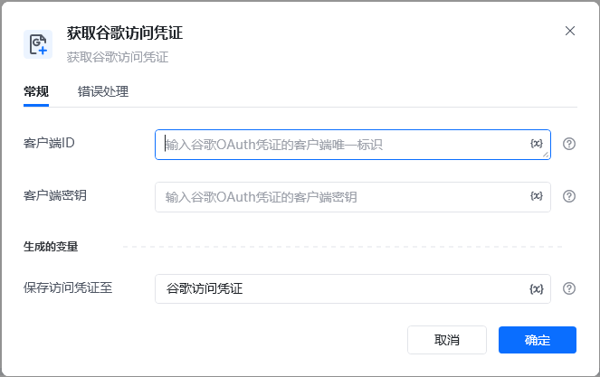
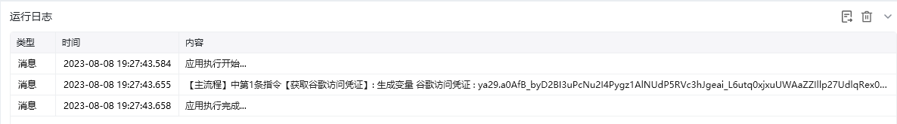

## 指令说明

**描述：**获取谷歌的访问凭证

## 参数说明

<Tabs>
  <Tab title="常规">
    

    | 参数 | 说明 |
    | --- | --- |
    | **使用用例** |  |
  </Tab>
  <Tab title="高级">
    
    
  </Tab>
</Tabs>

<Info>
  使用指令过程中遇到问题？前往 [八爪鱼RPA 开发者社区问答板块](https://rpa.bazhuayu.com/community/questions) 提问，获取官方与社区帮助。
</Info>
