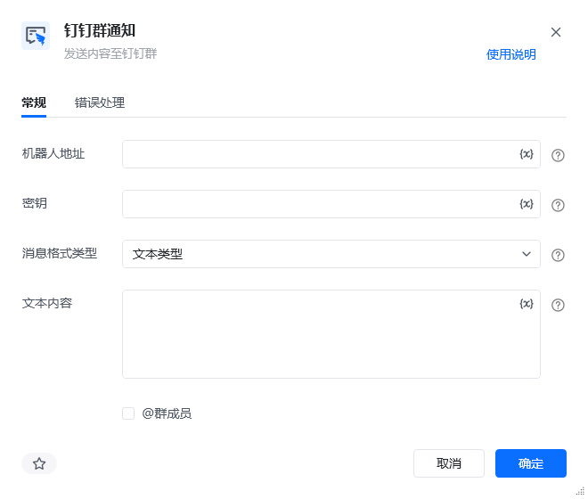
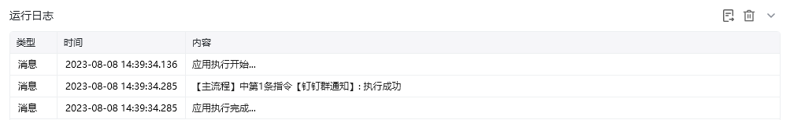

## 指令说明

**描述：** 通过钉钉群机器人 Webhook 向指定群聊发送通知，用于流程结果、异常和进度提醒。

## 参数说明

<Tabs>
  <Tab title="常规">

    

    | 参数 | 说明 |
    | --- | --- |
    | **机器人地址** | 机器人的网络地址，即webhook，机器人设置可查看教程：微信、飞书、钉钉群通知模块的使用 |
    | **密钥** | 机器人安全设置页面，加签一栏下面显示的SEC开头的字符串 |
    | **消息格式类型** | 单选项，选项含：文本类型/markdown类型/图文类型。 文本类型：仅发送纯文本消息，支持@全体群成员或某个群成员（通过输入成员手机号来实现@某个成员）、 markdown类型：输入markdown类型文本、 图文类型：输入消息标题，要求不超过128个字节，超过会自动截断；输入消息描述，要求不超过512个字节，超过会自动截断，非必填项；输入跳转链接，即被点击后所要跳转的内容链接；输入图文链接，支持JPG、PNG格式。 |
  </Tab>
  <Tab title="高级">
    本指令暂无高级参数。
  </Tab>
</Tabs>

## 使用示例

**该流程执行逻辑：**

1. 在【钉钉群通知】中选择或填写目标钉钉群的机器人授权信息。
2. 配置需要发送的消息内容并运行指令。
3. 指令调用群机器人接口，将消息发送到指定钉钉群；可在群聊中确认通知是否成功到达。

### 效果展示

<Info>
  使用指令过程中遇到问题？前往 [八爪鱼RPA 开发者社区问答板块](https://rpa.bazhuayu.com/community/questions) 提问，获取官方与社区帮助。
</Info>
