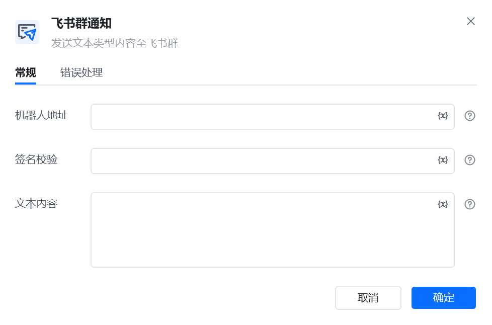

## 指令说明

**描述：** 通过飞书群机器人 Webhook 向指定群聊发送通知，用于流程结果、异常和进度提醒。

## 参数说明

<Tabs>
  <Tab title="常规">
    

    | 参数 | 说明 |
    | --- | --- |
    | **机器人地址** | 机器人的网络地址，即webhook，机器人设置可查看教程：微信、飞书、钉钉群通知模块的使用 |
    | **签名校验** | 在机器人安全设置中勾选签名校验后，填写提供密钥，可为空 |
    | **文本内容** | 输入要发送的文本内容 |
  </Tab>
  <Tab title="高级">
    本指令暂无高级参数。
  </Tab>
</Tabs>

## 使用示例

**该流程执行逻辑：**

1. 在飞书群中创建机器人，并将机器人 Webhook 地址填入指令。
2. 填写消息内容并执行【飞书群通知】，将消息发送到目标群。

### 效果展示

执行完成后，消息将发送到配置的飞书群机器人。

<Info>
  使用指令过程中遇到问题？前往 [八爪鱼RPA 开发者社区问答板块](https://rpa.bazhuayu.com/community/questions) 提问，获取官方与社区帮助。
</Info>
