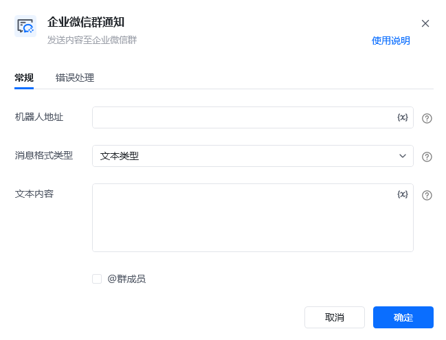
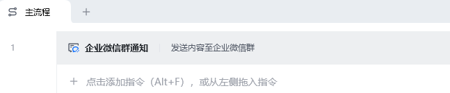
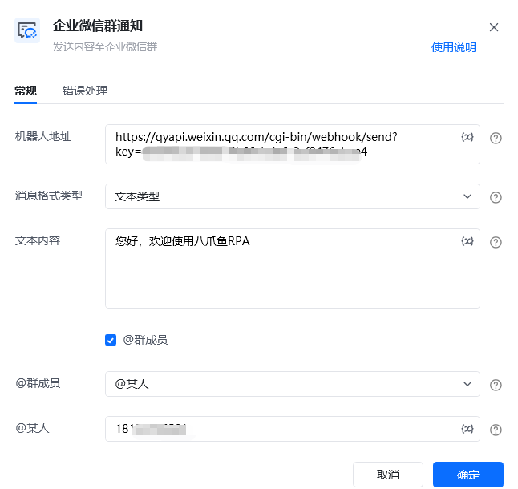
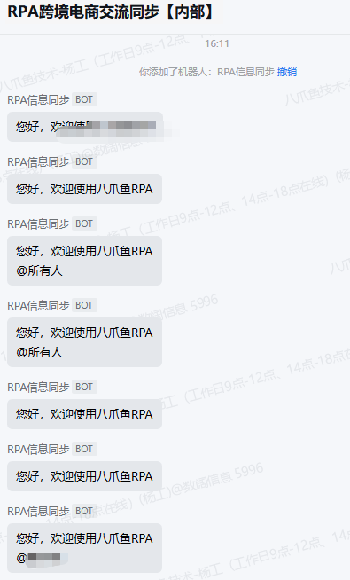

## 指令说明

**描述：** 通过RPA指令发送企业微信群消息。只需在企业微信建好机器人，并把机器人链接复制到RPA指令里，就可轻松的实现群消息的发送。

## 参数说明

<Tabs>
  <Tab title="常规">
    

    | 参数 | 说明 |
    | --- | --- |
    | **机器人地址** | 机器人的网络地址，即webhook，机器人设置可查看教程：微信、飞书、钉钉群通知模块的使用 |
    | **信息格式类型** | 文本类型/markdown类型/文件类型/图片类型/图文类型 文本类型：仅发送纯文本消息，支持@全体群成员或某个群成员、 markdown类型：输入markdown类型文本、 图片类型：选择要发送的图片，要求图片最大不能超过2M，支持JPG,PNG格式、 图文类型：输入消息标题，要求不超过128个字节，超过会自动截断；输入消息描述，要求不超过512个字节，超过会自动截断，非必填项；输入跳转链接，即被点击后所要跳转的内容链接；输入图文链接，支持JPG、PNG格式。 |
    | **内容** | 消息发送的内容，参考「信息格式类型」 |
    | **@群成员** | 事后需要@群成员（支持全体成员/群内某成员） |
    | **@某人** | 需填写@成员所绑定的手机号码。多个成员时可是使用";”间隔。 |
  </Tab>
  <Tab title="高级">
    本指令暂无高级参数。
  </Tab>
</Tabs>

## 使用示例

**该流程执行逻辑：**

### 运行结果

<Info>
  使用指令过程中遇到问题？前往 [八爪鱼RPA 开发者社区问答板块](https://rpa.bazhuayu.com/community/questions) 提问，获取官方与社区帮助。
</Info>
