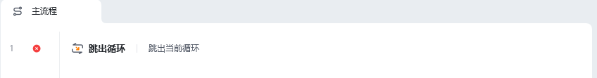
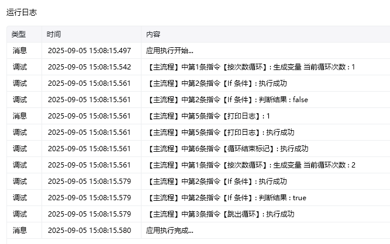

## 指令说明

**描述：** 跳出整个循环，终止当前循环的执行。【跳出循环】主要用于对【次数循环】、【列表循环】、【循环相似元素】等进行动态的控制。

## 参数说明

<Tabs>
  <Tab title="常规">
    

    本指令无常规参数，直接使用即可跳出当前循环。
  </Tab>
  <Tab title="高级">
    本指令暂无高级参数。
  </Tab>
</Tabs>

## 使用示例

**该流程执行逻辑：**

使用【按次数循环】设置起始数为 1、结束数为 3、递增值为 1

循环体执行【If 条件】指令判断当前循环数是否等于 2

若等于 2 则执行【跳出循环】

否则循环体执行【打印日志】指令打印当前循环值

直至循环结束

### 运行结果

循环到第 2 次时条件成立，跳出循环，只打印了第 1 次循环的值，后续不再执行。

<Info>
  使用指令过程中遇到问题？前往 [八爪鱼RPA 开发者社区问答板块](https://rpa.bazhuayu.com/community/questions) 提问，获取官方与社区帮助。
</Info>
