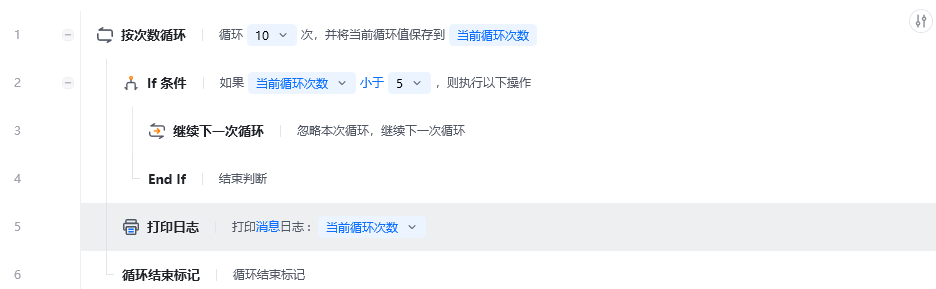
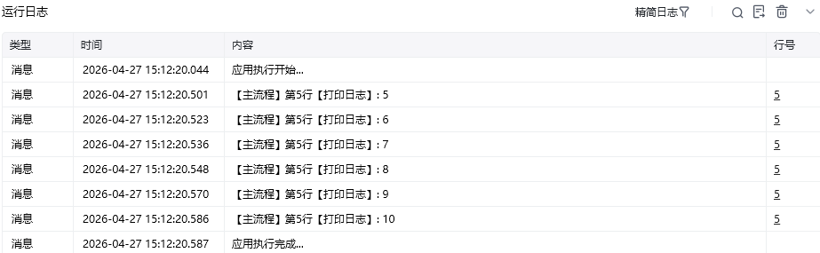

## 指令说明

**描述：** 立即跳过当前循环中剩余的指令，直接进入下一次循环。通常与"条件判断"类指令配合使用，当循环执行到某个条件时，提前结束本轮循环，避免执行不必要的后续步骤，从而提升流程执行效率。

## 参数说明

<Tabs>
  <Tab title="常规">
    

    本指令无常规参数，直接使用即可跳过当前循环的剩余步骤。
  </Tab>
  <Tab title="高级">
    本指令暂无高级参数。
  </Tab>
</Tabs>

## 使用示例

**该流程执行逻辑：**

设置循环数为 10

循环体执行【If 条件】指令判断当前循环值是否小于 5

若小于则执行【继续下一次循环】，跳过本轮后续步骤

否则循环体将当前循环次数打印到控制台中

直至循环结束

### 运行结果

当前循环值小于 5 时跳过打印，大于等于 5 时打印当前循环值，最终控制台输出循环值 5 到 10。

<Info>
  使用指令过程中遇到问题？前往 [八爪鱼RPA 开发者社区问答板块](https://rpa.bazhuayu.com/community/questions) 提问，获取官方与社区帮助。
</Info>
