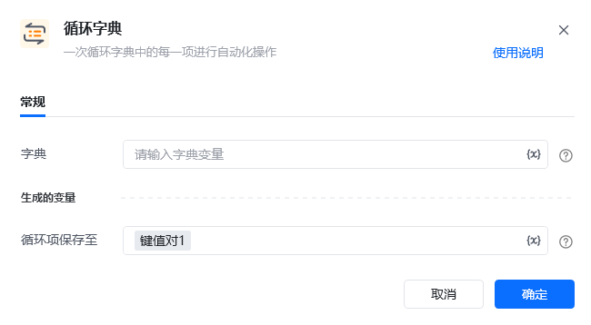

## 指令说明

**描述：** 依次循环字典中的每一项进行自动化操作。

<Info>
  【循环字典】循环出来的变量是一个键值对，可通过 `.Key` 的方法获取到它的 Key 名称；通过 `.Value` 的方法获取到它的 Value 值。
</Info>

## 参数说明

<Tabs>
  <Tab title="常规">
    

    | 参数 | 说明 |
    | --- | --- |
    | **字典** | 输入字典变量，选择前面指令创建的字典对象 |
  </Tab>
  <Tab title="高级">
    本指令暂无高级参数。
  </Tab>
</Tabs>

## 使用示例

**该流程执行逻辑：**

新增变量字典，并进行可视化编辑创建一个字典值

使用【循环字典】指令，将字典的每一项「键值对」循环出来

使用【打印日志】指令打印每个键值对的内容

### 运行结果

依次输出字典中每个键值对，可通过 `.Key` 获取键名，`.Value` 获取键值。

<Info>
  使用指令过程中遇到问题？前往 [八爪鱼RPA 开发者社区问答板块](https://rpa.bazhuayu.com/community/questions) 提问，获取官方与社区帮助。
</Info>
