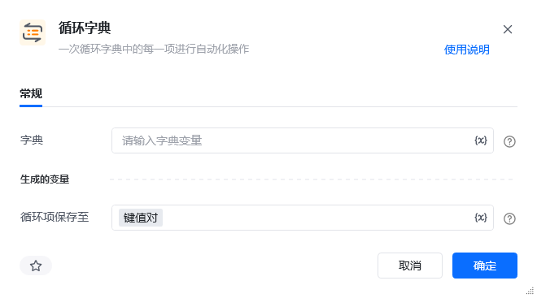
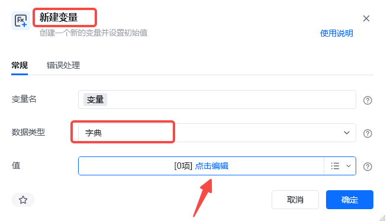
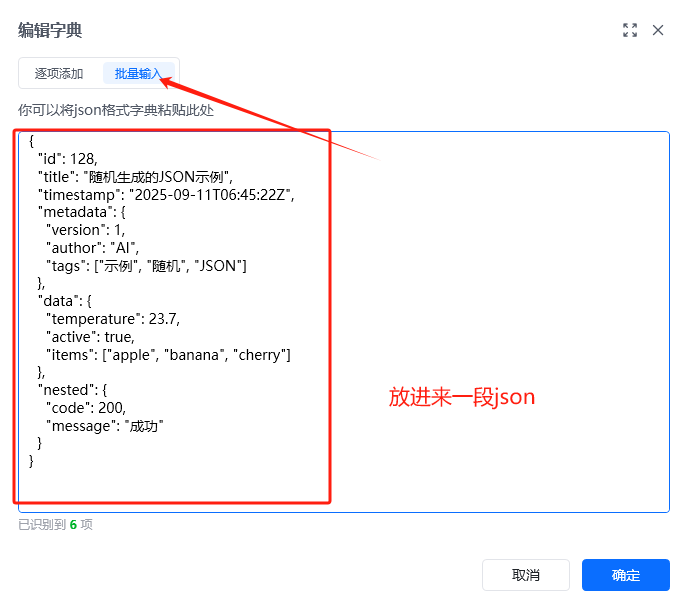
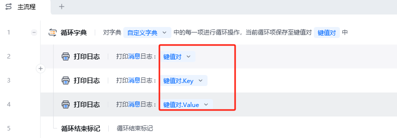
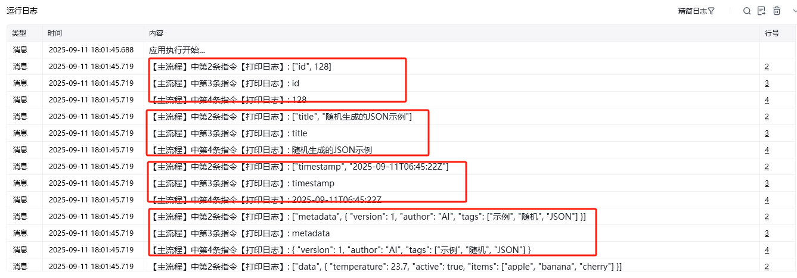

## 指令说明

**描述：** 依次循环字典中的每一项进行自动化操作。

<Info>
  【循环字典】循环出来的变量是一个键值对，可通过 `.Key` 的方法获取到它的 Key 名称；通过 `.Value` 的方法获取到它的 Value 值。
</Info>

## 参数说明

<Tabs>
  <Tab title="常规">
    

    | 参数 | 说明 |
    | --- | --- |
    | **字典** | 输入字典变量，选择前面指令创建的字典对象 |
  </Tab>
  <Tab title="高级">
    本指令暂无高级参数。
  </Tab>
</Tabs>

## 使用示例

### 新建字典





### 案例中 JSON 参考

```json
{
  "id": 128,
  "title": "随机生成的JSON示例",
  "timestamp": "2025-09-11T06:45:22Z",
  "metadata": {
    "version": 1,
    "author": "AI",
    "tags": ["示例", "随机", "JSON"]
  },
  "data": {
    "temperature": 23.7,
    "active": true,
    "items": ["apple", "banana", "cherry"]
  },
  "nested": {
    "code": 200,
    "message": "成功"
  }
}
```

### RPA 应用流程



### 效果展示

依次输出字典中每个键值对，可通过 `.Key` 获取键名，`.Value` 获取键值。



<Info>
  使用指令过程中遇到问题？前往 [八爪鱼RPA 开发者社区问答板块](https://rpa.bazhuayu.com/community/questions) 提问，获取官方与社区帮助。
</Info>
