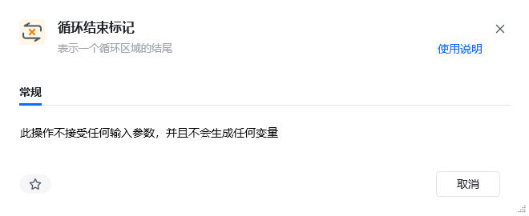
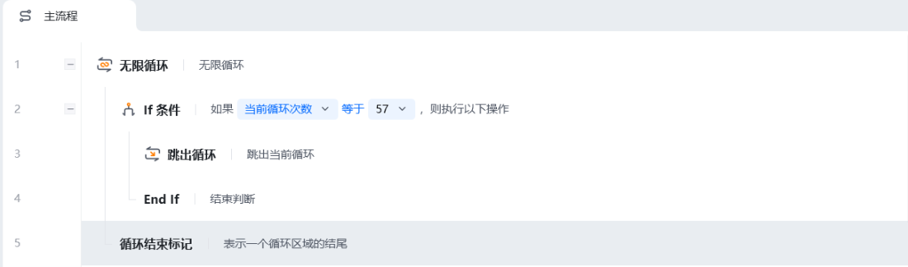
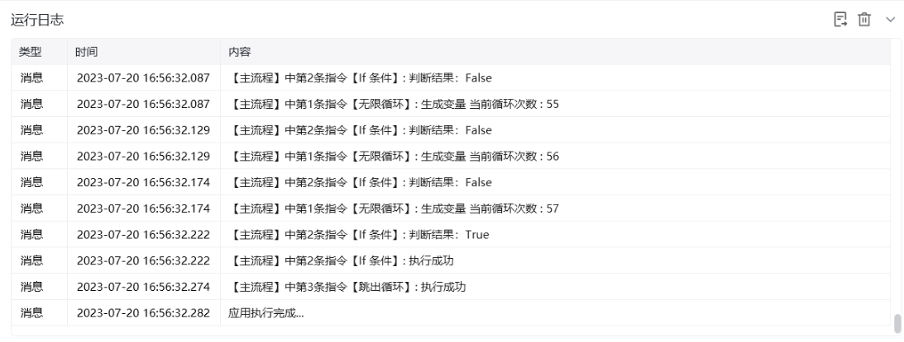

## 指令说明

**描述：** 循环结束标记，必须配合循环指令一起使用。

<Info>
  该指令需要与循环开始指令（如【按次数循环】、【条件循环】、【列表循环】、【无限循环】等）配对使用。循环开始指令和循环结束标记之间的指令即为循环体内容。
</Info>

## 参数说明

<Tabs>
  <Tab title="常规">
    

    本指令无常规参数，仅作为循环块的结束标记。
  </Tab>
  <Tab title="高级">
    本指令暂无高级参数。
  </Tab>
</Tabs>

## 使用示例

**该流程执行逻辑：**

【无限循环】跟【循环结束标记】之间的指令是循环体内容

每执行一次循环体里面的指令，"当前循环次数"自动加 1

设置【If 条件】，"当前循环次数"达到 57 的时候

执行【跳出循环】跳出无限循环

### 效果展示

循环执行 57 次后，条件成立跳出循环，流程继续执行后续指令。

<Info>
  使用指令过程中遇到问题？前往 [八爪鱼RPA 开发者社区问答板块](https://rpa.bazhuayu.com/community/questions) 提问，获取官方与社区帮助。
</Info>
