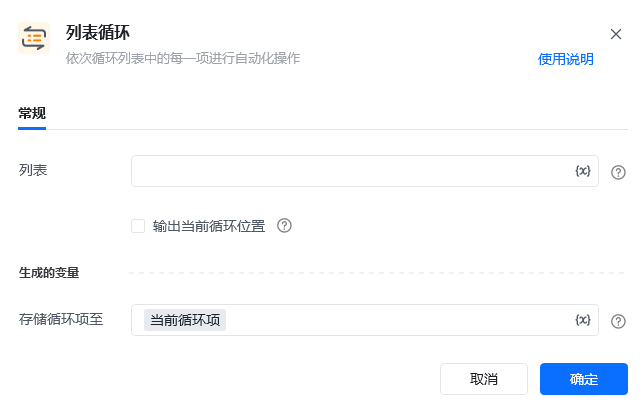
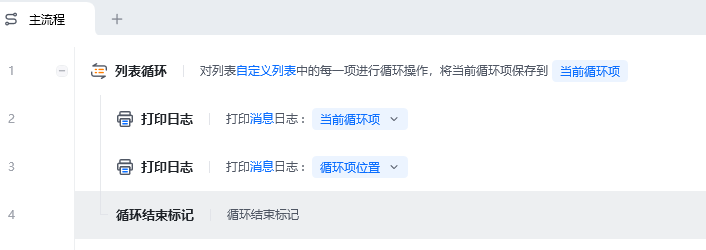
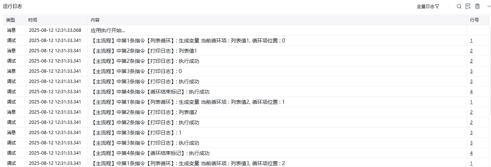

## 指令说明

**描述：** 依次循环列表中的每一项进行自动化操作。

<Info>
  该指令需要与 **End Loop** 指令配对使用，每次循环取出列表中的一个元素，供循环体内的指令使用。
</Info>

## 参数说明

<Tabs>
  <Tab title="常规">
    

    | 参数 | 说明 |
    | --- | --- |
    | **列表** | 输入列表项或者选择前面指令创建的列表（列表：表示多个数据项的一组，如 `["1", "2", "3"]`） |
    | **输出当前循环位置** | 如果勾选，则会自动输出当前循环项在列表中的位置，从 0 开始 |
    | **存储循环项至** | 选择一个列表变量，用于接收当前循环项 |
  </Tab>
  <Tab title="高级">
    本指令暂无高级参数。
  </Tab>
</Tabs>

## 使用示例

**该流程执行逻辑：**

定义一个「列表变量」

使用【列表循环】对「列表变量」的每一项进行循环

使用【打印日志】指令打印"当前循环项"与"循环项位置"

### 效果展示

依次输出列表中每个元素的值及其对应的位置索引（从 0 开始），逐个打印到控制台。

<Info>
  使用指令过程中遇到问题？前往 [八爪鱼RPA 开发者社区问答板块](https://rpa.bazhuayu.com/community/questions) 提问，获取官方与社区帮助。
</Info>
