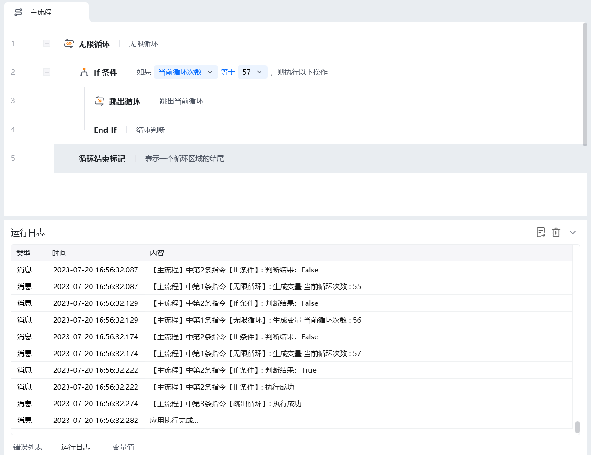

## 指令说明

**描述：** 无限循环，内部可以嵌套 If 条件，满足某个条件时退出循环。

<Info>
  该指令需要与 **End Loop** 指令配对使用。无限循环不会自动终止，必须在循环体内配合 **If 条件** + **跳出循环** 指令来结束循环，否则流程将一直运行。
</Info>

## 参数说明

<Tabs>
  <Tab title="常规">
    

    本指令无常规参数，直接使用即可开始无限循环。
  </Tab>
  <Tab title="高级">
    本指令暂无高级参数。
  </Tab>
</Tabs>

## 使用示例

**该流程执行逻辑：**

使用【无限循环】，每执行一次循环体里面的指令，"当前循环次数"起始值为 1，每循环一次循环次数自动加 1

设置【If 条件】，"当前循环次数"达到 57 的时候判断条件成立

条件成立后执行【跳出循环】

### 运行结果

循环执行 57 次后，条件成立跳出循环，流程继续执行后续指令。

<Info>
  使用指令过程中遇到问题？前往 [八爪鱼RPA 开发者社区问答板块](https://rpa.bazhuayu.com/community/questions) 提问，获取官方与社区帮助。
</Info>
