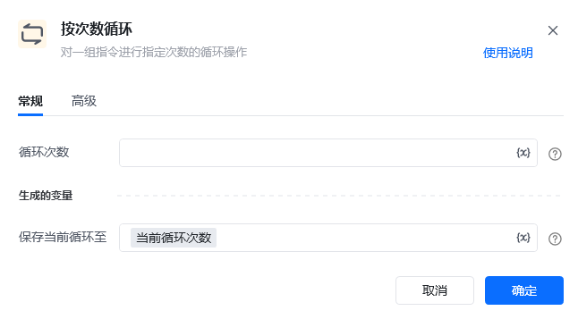
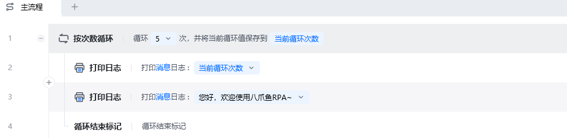
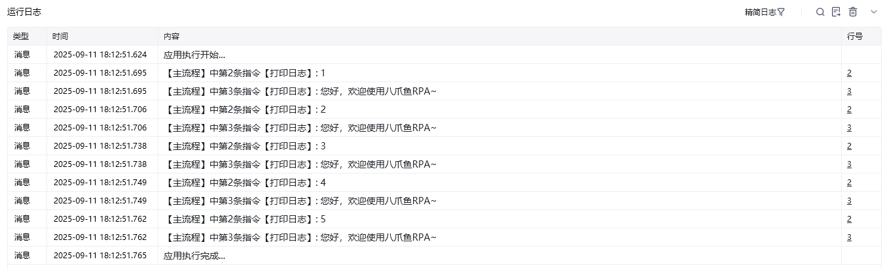

## 指令说明

**描述：** 对一组指令进行指定次数的循环操作（指令里设置的次数）。

<Info>
  该指令需要与 **End Loop** 指令配对使用，循环体内部的指令将重复执行指定的次数。
</Info>

## 参数说明

<Tabs>
  <Tab title="常规">
    

    | 参数 | 说明 |
    | --- | --- |
    | **循环次数** | 设置循环的次数，数据类型必须是数值整数，可接收变量参数 |
  </Tab>
  <Tab title="高级">
    本指令暂无高级参数。
  </Tab>
</Tabs>

## 使用示例

**该流程执行逻辑：**

使用【按次数循环】设置循环数为 5 次

循环体执行【打印日志】指令打印当前循环次数

循环体打印"您好，欢迎使用八爪鱼RPA~"

### 效果展示

控制台依次输出 5 次日志，每次显示当前循环次数和欢迎语"您好，欢迎使用八爪鱼RPA~"。

<Info>
  使用指令过程中遇到问题？前往 [八爪鱼RPA 开发者社区问答板块](https://rpa.bazhuayu.com/community/questions) 提问，获取官方与社区帮助。
</Info>
