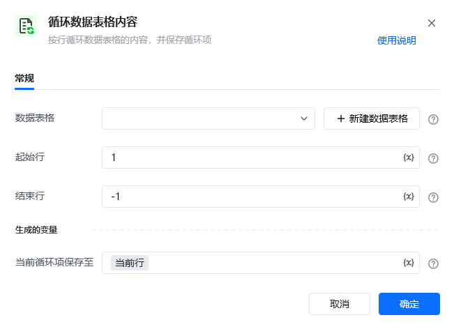
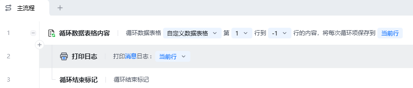
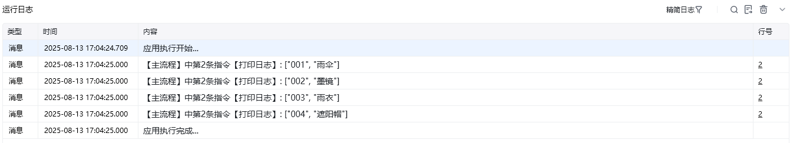

## 指令说明

**描述：** 按行循环数据表格的内容，并保存循环项。

<Info>
  【循环数据表格内容】的循环项是数据表格的一行数据，在 RPA 中是列表类型的变量，读取每行的每个列值时从 0 开始。即选择列表中的第一个数据，序号是 0 而不是 1；取列表最后一项数据，可以用序号 -1。
</Info>

## 参数说明

<Tabs>
  <Tab title="常规">
    

    | 参数 | 说明 |
    | --- | --- |
    | **数据表格** | 选择一个获取到的或者通过"导入 Excel/CSV 至数据表格"来创建的数据表格对象 |
    | **起始行** | 循环的起始行号，第一行从 1 开始 |
    | **结束行** | 循环的结束行号，最后一行可用 -1 表示 |
  </Tab>
  <Tab title="高级">
    本指令暂无高级参数。
  </Tab>
</Tabs>

## 使用示例

**该流程执行逻辑：**

使用【循环数据表格内容】指令循环第 1 行到第 -1 行的内容

将循环项命名为「当前行」

在循环体中使用【打印日志】指令打印「当前行」内容

### 运行结果

依次打印数据表格中每一行的内容，实现表格数据的逐行处理。

<Info>
  使用指令过程中遇到问题？前往 [八爪鱼RPA 开发者社区问答板块](https://rpa.bazhuayu.com/community/questions) 提问，获取官方与社区帮助。
</Info>
