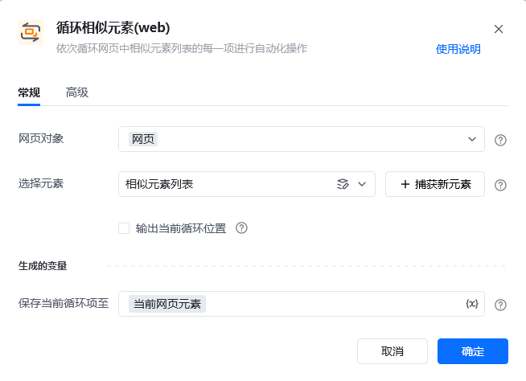
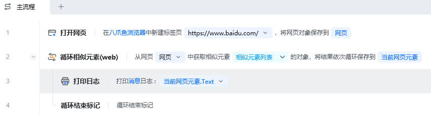
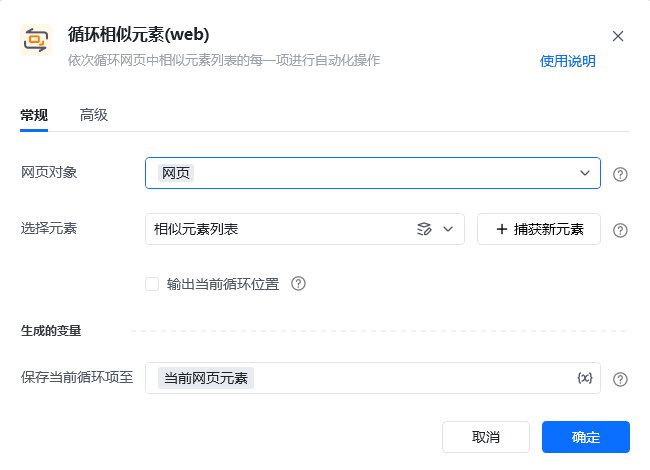

## 指令说明

**描述：** 循环迭代一个网页元素列表，并且把当前的迭代元素作为流程变量输出，供后续流程使用。常用于对一个网页元素列表挨个进行处理的场景。

## 参数说明

<Tabs>
  <Tab title="常规">
    

    | 参数 | 说明 |
    | --- | --- |
    | **网页对象** | 选择相似元素组所在的网页对象 |
    | **选择元素** | 从已有的元素库中选择一个已捕获的相似元素或通过「捕获新元素」来捕获新的网页元素作为相似元素的操作目标 |
    | **输出当前循环位置** | 自动输出当前元素在相似元素列表中的位置，从 0 开始 |
  </Tab>
  <Tab title="高级">
    | 参数 | 说明 |
    | --- | --- |
    | **等待元素存在（s）** | 等待目标元素存在的超时时间（秒） |
  </Tab>
</Tabs>

## 使用示例

**该流程执行逻辑：**

使用【打开网页】指令打开指定网页（案例中：https://www.baidu.com/）

在当前网页上获取相似元素组

使用【循环相似元素(web)】指令对相似元素进行循环遍历

循环体内使用【打印日志】指令将当前的循环相似元素的 `.Text` 文本内容打印出来

### 效果展示

依次打印出百度首页每个相似元素的文本内容，实现对网页元素列表的批量处理。

<Info>
  使用指令过程中遇到问题？前往 [八爪鱼RPA 开发者社区问答板块](https://rpa.bazhuayu.com/community/questions) 提问，获取官方与社区帮助。
</Info>
