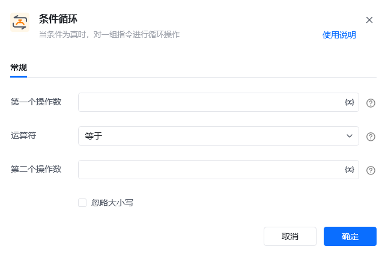
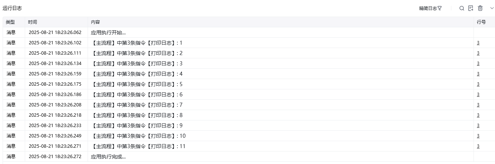

## 指令说明

**描述：** 当条件为真时，对一组指令进行循环操作。

<Info>
  该指令需要与【循环结束标记】指令配对使用。
</Info>

## 参数说明

<Tabs>
  <Tab title="常规">
    

    | 参数 | 说明 |
    | --- | --- |
    | **第一个操作数** | 输入前面指令创建的变量、表达式、文本、数字或符号，与第二个操作数进行比较 |
    | **运算符** | 选择第一个操作数和第二个操作数之间的关系（等于、不等于、大于、大于等于、小于、小于等于、包含、不包含、为真(is true)等） |
    | **第二个操作数** | 输入前面指令创建的变量、表达式、文本、数字或符号，与第一个操作数进行比较 |
  </Tab>
  <Tab title="高级">
    本指令暂无高级参数。
  </Tab>
</Tabs>

## 使用示例

**该流程执行逻辑：**

初始化设置变量名「计数」的数值为 0

使用【条件循环】指令判断「计数」是否小于等于 10

如果「计数」小于等于 10，则循环执行「计数」+1 再把值赋给「计数」

执行【打印日志】指令打印当前「计数」的值

### 效果展示

循环过程中，每次打印当前计数的值，从 1 递增到 11，共打印 11 次日志。

<Info>
  使用指令过程中遇到问题？前往 [八爪鱼RPA 开发者社区问答板块](https://rpa.bazhuayu.com/community/questions) 提问，获取官方与社区帮助。
</Info>
