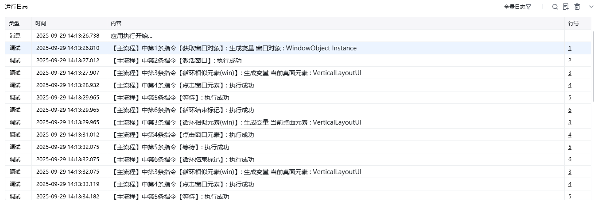

## 指令说明

**描述：** 依次循环窗口中相似元素列表的每一项进行自动化操作。

## 参数说明

<Tabs>
  <Tab title="常规">
    

    | 参数 | 说明 |
    | --- | --- |
    | **选择元素** | 从「元素库」中选择一个已捕获的元素或通过「捕获新元素」来捕获新的窗口元素作为操作目标 |
    | **输出当前循环位置** | 如果勾选，则会自动输出当前循环项在列表中的位置，从 0 开始 |
  </Tab>
  <Tab title="高级">
    | 参数 | 说明 |
    | --- | --- |
    | **等待元素存在（s）** | 等待目标元素存在的超时时间 |
  </Tab>
</Tabs>

## 使用示例

**该流程执行逻辑：**

获取窗口对象：企业微信

激活「企业微信」窗口

使用指令【循环相似元素（win）】，在「企业微信」中顺序循环点击切换每个聊天会话框

### 效果展示

依次点击企业微信中的每个聊天会话框，实现窗口元素的批量操作。

<Info>
  使用指令过程中遇到问题？前往 [八爪鱼RPA 开发者社区问答板块](https://rpa.bazhuayu.com/community/questions) 提问，获取官方与社区帮助。
</Info>
