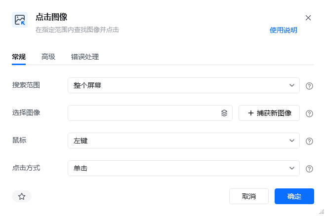
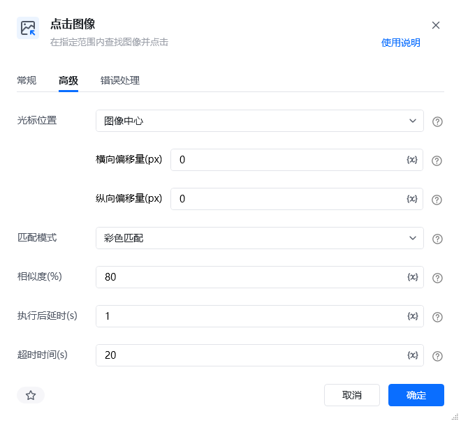
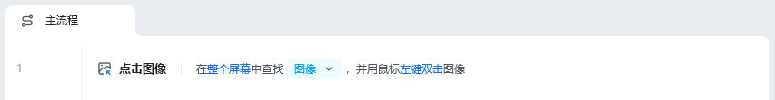
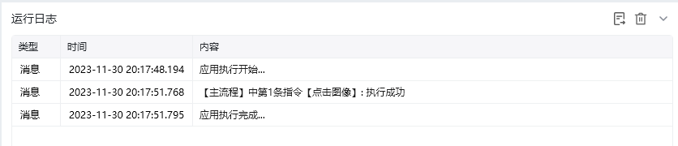

## 指令说明

**描述：** 在指定范围内查找图像并点击。

## 参数说明

| 参数 | 说明 |
| --- | --- |
| **搜索范围** | 查找目标图像的范围，可选：整个屏幕、窗口对象或当前激活窗口 |
| **选择图像** | 选择已存在的图像，或捕获新图像 |
| **鼠标** | 选择鼠标点击的按键，可选：左键、右键 |
| **点击方式** | 选择鼠标点击的方式，可选：单击、双击 |
| **添加窗口类型** | 一般在存在多个相同标题的窗口的情况下使用 |
| **根据正则匹配** | 根据通配符匹配，比如 `*记事本` 表示以记事本结尾的任意 |
| **窗口是否** | 存在/不存在 |

### 高级

| 参数 | 说明 |
| --- | --- |
| **光标位置** | 请选择光标偏移的起点，默认为图像中 |
| **相似度** | 指定目标图像与原始图像的相似程度，推荐相似度为 80% |
| **匹配模式** | 查找图像的匹配方式，彩色匹配相对灰度匹配更加精确 |
| **横向偏移量（px）** | 输入 10 表示将光标从光标位置开始右移 10px，-10 则表示左移 10px |
| **纵向偏移量（px）** | 输入 10 表示将光标从光标位置开始下移 10px，-10 则表示上移 10px |

## 使用示例

点击捕获图像，捕获桌面微信图标

设置点击指令，点击方式为双击

### 运行结果

**该流程执行逻辑：**

使用【点击图像】指令，在整个屏幕查找微信应用图标【图像】，并用鼠标左键双击图像，打开微信

<Info>
  使用指令过程中遇到问题？前往 [八爪鱼RPA 开发者社区问答板块](https://rpa.bazhuayu.com/community/questions) 提问，获取官方与社区帮助。
</Info>
