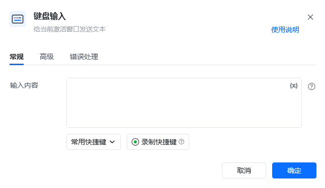
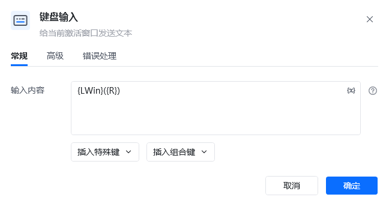
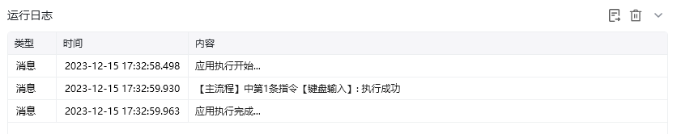
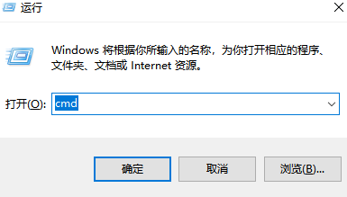

## 指令说明

**描述：** 给当前激活的窗口发送文本。

## 参数说明

<Tabs>
  <Tab title="常规">
    

    | 参数 | 说明 |
    | --- | --- |
    | **输入内容** | 要发送到应用程序的文本。要模拟正在按下的物理键，请使用大括号 `{}`，例如要模拟按下 Enter，请使用 `{Enter}`。要使用组合物理按键，请对两个键都使用大括号 `{}`，例如要按 Ctrl + A，请使用 `{Control}({A})` |
    | **常用快捷键** | 使用频率高的快捷键可自选，单击想选中的快捷键组合即可。目前有：Ctrl+C、Ctrl+V、Ctrl+X、Ctrl+Z、Ctrl+S、Ctrl+A、Enter、Windows+D |
    | **录制快捷键** | 按下此按钮后，您可以通过按下键盘上的按键自动生成快捷键。注：与 Windows 相关且会造成息屏的组合键可能无法录制成功，此时可手动输入 `{Window}`，输入后再去添加 `({})` 生成目标组合键 |
  </Tab>
  <Tab title="高级">
    | 参数 | 说明 |
    | --- | --- |
    | **按键输入间隔（ms）** | 两次按键输入的间隔时间，单位为毫秒 |
    | **执行后延迟（s）** | 指令执行完成后的等待时间，单位为秒 |
  </Tab>
</Tabs>

## 使用示例

**该流程执行逻辑：**

使用【键盘输入】指令输入 `{LWin}({R})`，唤起「运行窗口」

### 运行结果

<Info>
  使用指令过程中遇到问题？前往 [八爪鱼RPA 开发者社区问答板块](https://rpa.bazhuayu.com/community/questions) 提问，获取官方与社区帮助。
</Info>
