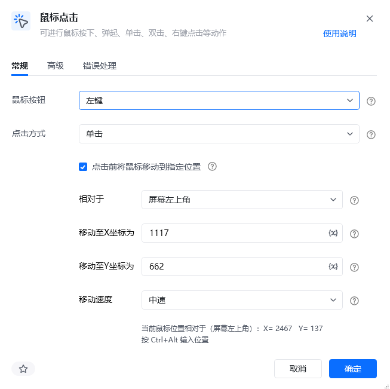
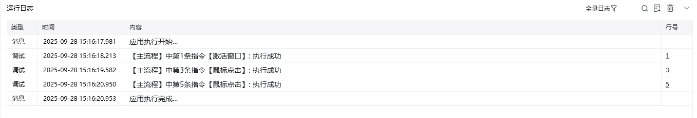
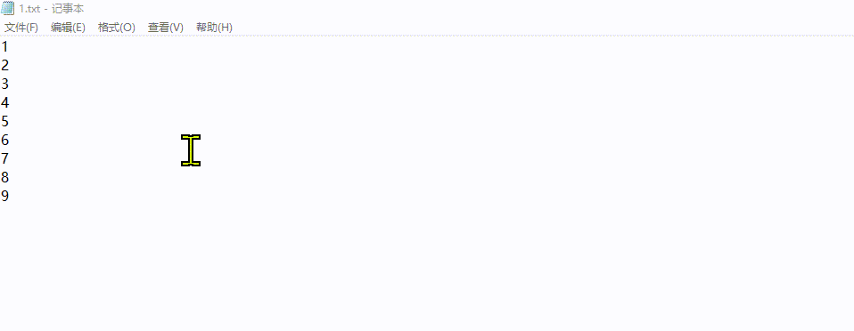

## 指令说明

**描述：** 可进行鼠标按下、弹起、单击、双击、右键点击等动作。

## 参数说明

<Tabs>
  <Tab title="常规">
    

    | 参数 | 说明 |
    | --- | --- |
    | **鼠标按钮** | 选择鼠标按钮，可选：左键、中键、右键 |
    | **点击方式** | 选择点击方式，可选：单击、双击、弹起、按下 |
    | **点击前将鼠标移动到指定位置** | 点击前是否将鼠标移动到指定位置，勾选后需设置目标坐标 |
    | **相对于** | 选择新鼠标位置相对于屏幕左上角、激活窗口左上角或运行过程中鼠标当前位置。支持三种模式：屏幕左上角、激活窗口左上角、运行中当前鼠标位置 |
    | **移动至X坐标为** | 输入移动至X轴坐标（按 Ctrl+Alt 自动填充鼠标位置） |
    | **移动至Y坐标为** | 输入移动至Y轴坐标（按 Ctrl+Alt 自动填充鼠标位置） |
    | **移动速度** | 选择鼠标移动速度，可选：瞬间、快速、中速、慢速 |
  </Tab>
  <Tab title="高级">
    | 参数 | 说明 |
    | --- | --- |
    | **键盘辅助按钮** | 在点击时需要按下的键盘功能键，可选：无、Alt、Ctrl、Shift、Win |
    | **执行后延迟（s）** | 指令执行完成后的等待时间，单位为秒 |
  </Tab>
</Tabs>

## 使用示例

**该流程执行逻辑：**

执行【激活窗口】命令激活1.txt窗口

执行【鼠标点击】命令将鼠标移动至相对于激活窗口左上角的坐标 20,30，鼠标左键单击

执行【鼠标点击】命令将鼠标移动至相对于激活窗口左上角的坐标 40,140，鼠标左键单击

### 效果展示

<Info>
  使用指令过程中遇到问题？前往 [八爪鱼RPA 开发者社区问答板块](https://rpa.bazhuayu.com/community/questions) 提问，获取官方与社区帮助。
</Info>
