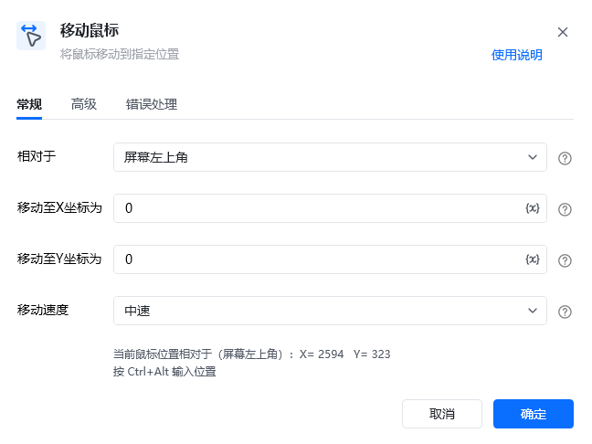

## 指令说明

**描述：** 将鼠标移动到指定位置。

## 参数说明

| 参数 | 说明 |
| --- | --- |
| **相对于** | 选择新鼠标位置相对于屏幕左上角、激活窗口左上角或运行过程中鼠标当前位置。支持三种模式：屏幕左上角、激活窗口左上角、运行中当前鼠标位置 |
| **移动至X坐标为** | 输入移动至X轴坐标（按 Ctrl+Alt 自动填充鼠标位置） |
| **移动至Y坐标为** | 输入移动至Y轴坐标（按 Ctrl+Alt 自动填充鼠标位置） |
| **移动速度** | 选择鼠标移动速度，可选：瞬间、快速、中速、慢速 |

### 高级

| 参数 | 说明 |
| --- | --- |
| **执行后延迟（S）** | 指令执行完成后的等待时间，单位为秒 |

## 使用示例

**该流程执行逻辑：**

使用【获取窗口对象】获取标题为1.txt的窗口，将窗口对象保存到窗口对象

执行【激活窗口】命令激活1.txt窗口

使用【移动鼠标】命令将鼠标移动至相对于激活窗口左上角的坐标 1499,149

使用【移动鼠标】命令将鼠标移动至相对于激活窗口左上角的坐标 69,919

使用【移动鼠标】命令将鼠标移动至相对于激活窗口左上角的坐标 1548,938

<Info>
  使用指令过程中遇到问题？前往 [八爪鱼RPA 开发者社区问答板块](https://rpa.bazhuayu.com/community/questions) 提问，获取官方与社区帮助。
</Info>
