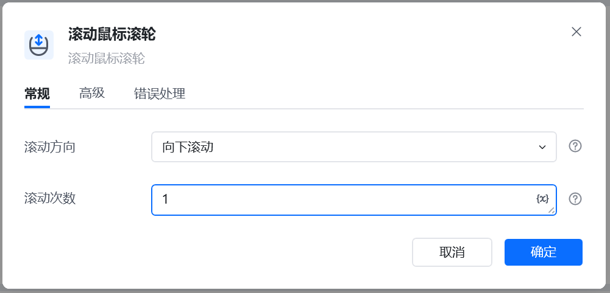
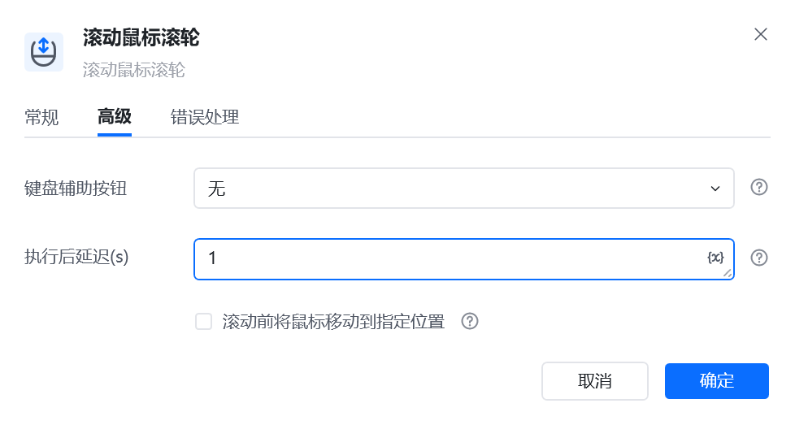

## 指令说明

**描述：** 控制鼠标进行滚动鼠标滚轮。

## 参数说明

<Tabs>
  <Tab title="常规">
    

    | 参数 | 说明 |
    | --- | --- |
    | **滚动方向** | 指定滚动方向，可选：向上滚动、向下滚动 |
    | **滚动次数** | 指定滚动需要滚动的次数 |
  </Tab>
  <Tab title="高级">
    | 参数 | 说明 |
    | --- | --- |
    | **键盘辅助按钮** | 在点击时需要按下的键盘功能键，可选：无、Alt、Ctrl、Shift、Win |
    | **执行后延迟（s）** | 指令执行完成后的等待时间，单位为秒 |
  </Tab>
</Tabs>

## 使用示例

**该流程执行逻辑：**

使用【获取窗口对象】获取标题为1.txt的窗口，将窗口对象保存到窗口对象

执行【激活窗口】命令激活1.txt窗口

执行【鼠标悬停在窗口元素上】命令将鼠标移动到窗口元素上

执行【滚动鼠标滚轮】命令向下滚动鼠标滚轮3次

### 运行结果

<Info>
  使用指令过程中遇到问题？前往 [八爪鱼RPA 开发者社区问答板块](https://rpa.bazhuayu.com/community/questions) 提问，获取官方与社区帮助。
</Info>
