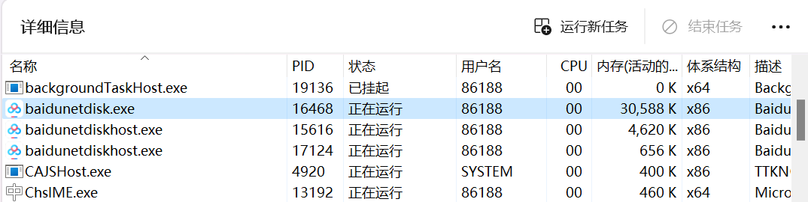

## 指令说明

**描述：** 可以根据进程ID或进程名称判断当前系统中是否正在运行对应的进程

## 参数说明

<Tabs>
  <Tab title="常规">
    

    | 参数 | 说明 |
    | --- | --- |
    | **进程属性** | 指定待判断进程的方式，支持进程PID和进程名称两种 |
    | **进程名称/进程ID** | 输入待判断进程的PID或进程名称 |
  </Tab>
  <Tab title="高级">
    本指令暂无高级参数。
  </Tab>
</Tabs>

## 使用示例

**该流程执行逻辑：**

注：进程名称需在“任务管理器”中查看，打开任务管理器后切换至“详细信息”，取.exe前面的名称，区分大小写

使用【检查进程是否存在】检查PID为16468的进程是否在系统存在，判断结果为True

使用【终止进程】立刻停止PID为16468的进程

使用【检查进程是否存在】检查PID为16468的进程是否在系统存在，判断结果为False

### 效果展示

<Info>
  使用指令过程中遇到问题？前往 [八爪鱼RPA 开发者社区问答板块](https://rpa.bazhuayu.com/community/questions) 提问，获取官方与社区帮助。
</Info>
