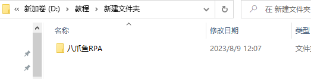
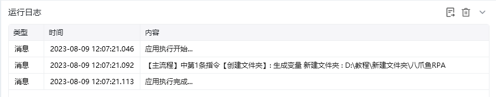

## 指令说明

**描述：** 在指定路径下创建新的文件夹，供后续文件保存、移动或整理操作使用。

## 参数说明

<Tabs>
  <Tab title="常规">

    

    | 参数 | 说明 |
    | --- | --- |
    | **父文件夹目录** | 输入或选择要在其中创建新文件夹的文件夹路径 |
    | **新文件夹名称** | 输入要创建的文件夹名称 |
    | **生成的变量** | 保存新文件夹路径变量 |
  </Tab>
  <Tab title="高级">
    本指令暂无高级参数。
  </Tab>
</Tabs>

## 使用示例

**该流程执行逻辑：**

1. 在【创建文件夹】中将父目录设置为 `D:\教程\新建文件夹`，新文件夹名称设置为“八爪鱼RPA”。
2. 运行后，系统在父目录下创建 `八爪鱼RPA` 文件夹。
3. 后续流程可将文件写入该目录，或将生成的文件夹路径传给其他文件操作指令。

### 效果展示

<Info>
  使用指令过程中遇到问题？前往 [八爪鱼RPA 开发者社区问答板块](https://rpa.bazhuayu.com/community/questions) 提问，获取官方与社区帮助。
</Info>
