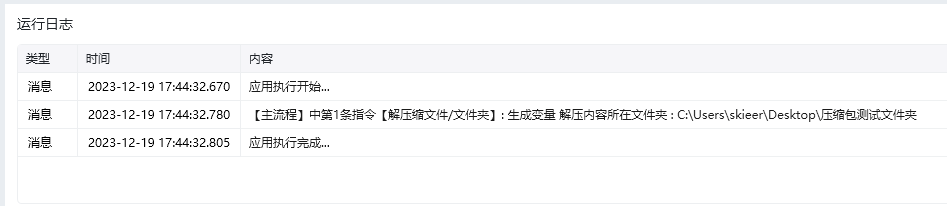

## 指令说明

**描述：** 将zip文件解压到指定位置

## 参数说明

<Tabs>
  <Tab title="常规">
    

    | 参数 | 说明 |
    | --- | --- |
    | **待解压文件** | 需解压的文件路径 |
    | **解压至** | 选择将解压后的文件保存到源文件同级目录还是指定的文件夹中 |
    | **创建同名文件夹** | 勾选后，将在所选文件夹中新建与压缩文件同名的文件夹，并将压缩包解压到该文件夹中 |
    | **解压密码** | 用于解压zip文件的密码，若没有则无需填写 |
    | **结果保存至** | 将解压后的文件路径列表保存至此变量，若不存在则自动创建 |
  </Tab>
  <Tab title="高级">
    本指令暂无高级参数。
  </Tab>
</Tabs>

## 使用示例

**该流程执行逻辑：**

使用【解压缩文件】命令将压缩包解压至源文件所在的路径，并将结果保存到变量：解压内容所在文件夹

### 运行结果

<Info>
  使用指令过程中遇到问题？前往 [八爪鱼RPA 开发者社区问答板块](https://rpa.bazhuayu.com/community/questions) 提问，获取官方与社区帮助。
</Info>
