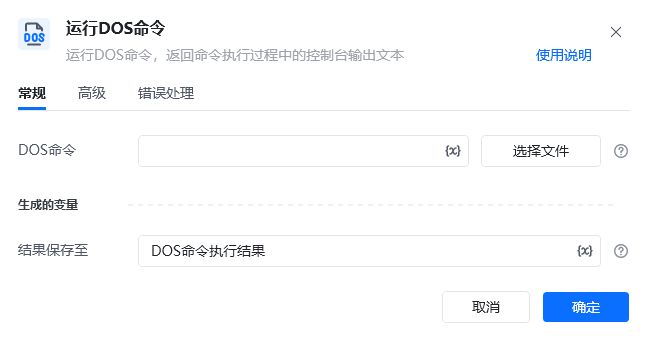
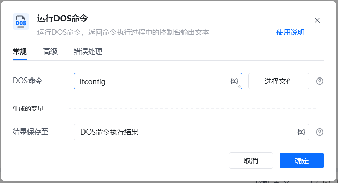
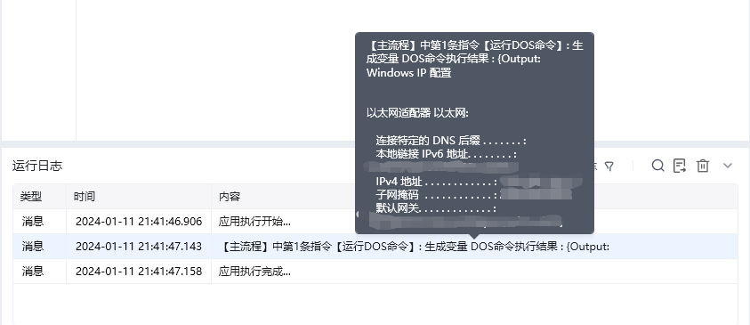
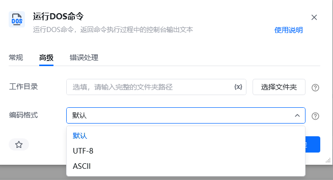

## 指令说明

**描述：** 运行DOS命令，返回命令执行过程中的控制台输出文本

## 参数说明

<Tabs>
  <Tab title="常规">
    

    | 参数 | 说明 |
    | --- | --- |
    | **DOS命令** | 输入需要执行的DOS命令/参数 |
    | **结果保存至** | 将DOS命令执行后输出的文本保存至此变量，不填写则不输出 |
  </Tab>
  <Tab title="高级">
    | 参数 | 说明 |
    | --- | --- |
    | **工作目录** | 指定要在哪个文件夹下启动执行DOS命令，不填写则默认是启动程序所在文件夹 |
    | **编码格式** | 读取输出时使用的编码格式，默认，UTF-8，ASCII |
  </Tab>
</Tabs>

## 使用示例

**该流程执行逻辑：**

例如使用 ipconfig 指令查询主机ip信息，结果输出至变量【DOS命令执行结果】

使用【运行DOS命令】指令，生成变量【DOS命令执行结果】`{Output:......IPv6地址..........}`

常见DOS指令教学讲解

### 运行结果

<Info>
  使用指令过程中遇到问题？前往 [八爪鱼RPA 开发者社区问答板块](https://rpa.bazhuayu.com/community/questions) 提问，获取官方与社区帮助。
</Info>
