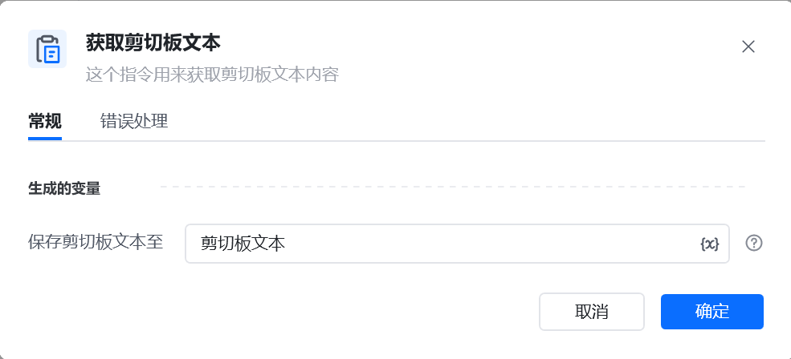

## 指令说明

**描述：** 这个指令用来获取剪切板文本内容

## 参数说明

<Tabs>
  <Tab title="常规">
    

    | 参数 | 说明 |
    | --- | --- |
    | **生成的变量** | 获取剪切板中文本内容 |
  </Tab>
  <Tab title="高级">
    本指令暂无高级参数。
  </Tab>
</Tabs>

## 使用示例

**该流程执行逻辑：**

使用【添加内容到剪切板】命令将文本“八爪鱼教程内容”添加到剪切板

使用【获取剪切板文本】获取当前剪切板的文本，并放到变量剪切板文本

使用【打印日志】打印该变量，打印结果为：八爪鱼教程内容

### 运行结果

<Info>
  使用指令过程中遇到问题？前往 [八爪鱼RPA 开发者社区问答板块](https://rpa.bazhuayu.com/community/questions) 提问，获取官方与社区帮助。
</Info>
