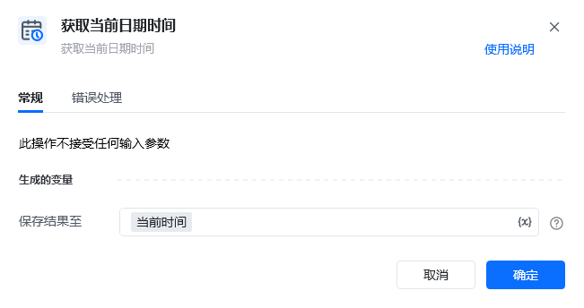
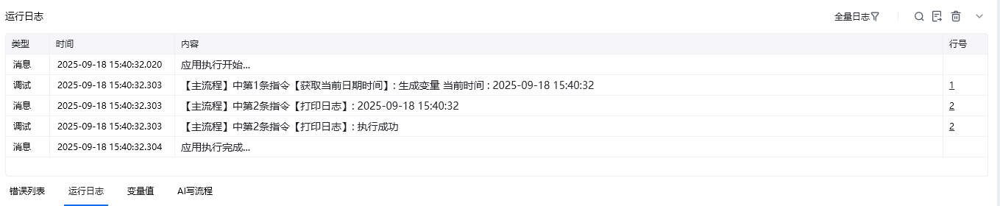

## 指令说明

**描述：** 获取当前日期时间

## 参数说明

<Tabs>
  <Tab title="常规">
    

    | 参数 | 说明 |
    | --- | --- |
    | **保存结果至** | 保存获取到的当前日期时间为变量。即指定一个变量名称，该变量用于保存当前时间。 |
  </Tab>
  <Tab title="高级">
    本指令暂无高级参数。
  </Tab>
</Tabs>

## 使用示例

**该流程执行逻辑：**

使用【获取当前日期时间】获取当前日期时间保存至变量当前时间 ---&gt; 打印当前时间消息日志

RPA应用运行后

### 运行结果

<Info>
  使用指令过程中遇到问题？前往 [八爪鱼RPA 开发者社区问答板块](https://rpa.bazhuayu.com/community/questions) 提问，获取官方与社区帮助。
</Info>
