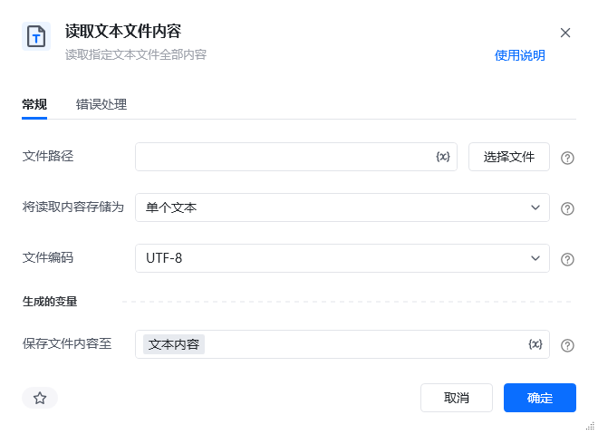
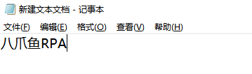
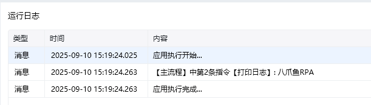

## 指令说明

**描述：** 读取指定文本文件全部内容

## 参数说明

<Tabs>
  <Tab title="常规">

    

    | 参数 | 说明 |
    | --- | --- |
    | **文件路径** | 输入或选择文件路径 |
    | **将读取内容存储为** | 下拉选择将读取内容存储为： 单个文本：将读取内容保存到一个文本中、 文本列表（每一行保存为列表的一项）：按行获取列表内容并存储到列表中 |
    | **文件编码** | 下拉选择文件编码方式： 系统默认、 UTF-8、 ASCll、 UTF-8 Bom、 Unicode、 GBK、 GB2312 |
    | **保存文件内容至** | 文本内容 |
  </Tab>
  <Tab title="高级">
    本指令暂无高级参数。
  </Tab>
</Tabs>

## 使用示例

**该流程执行逻辑：**

使用【读取文本文件内容】指令读取指定文件的文本内容并将结果保存到文本内容

使用【打印日志】打印消息日志文本内容

### 效果展示

<Info>
  使用指令过程中遇到问题？前往 [八爪鱼RPA 开发者社区问答板块](https://rpa.bazhuayu.com/community/questions) 提问，获取官方与社区帮助。
</Info>
