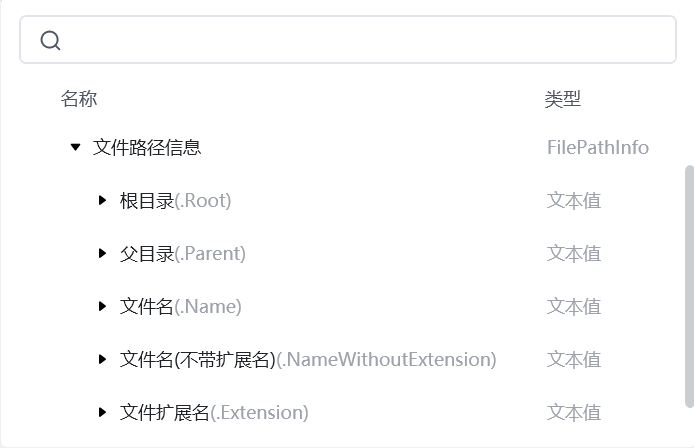
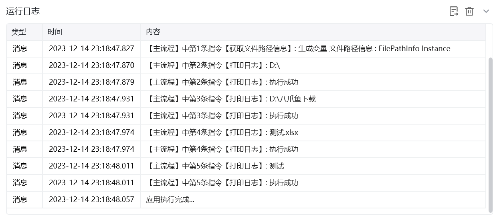

## 指令说明

**描述：** 获取文件路径的根目录、父目录、文件名、基本文件名和文件扩展名

## 参数说明

<Tabs>
  <Tab title="常规">

    

    | 参数 | 说明 |
    | --- | --- |
    | **文件路径** | 输入要获取文件路径信息的文件夹路径 |
    | **生成的变量** | 输入一个名字用来保存文件路径信息。 |
  </Tab>
  <Tab title="高级">
    本指令暂无高级参数。
  </Tab>
</Tabs>

## 使用示例

**该流程执行逻辑：**

使用【获取文件路径信息】命令获取D:\八爪鱼下载\测试.xlsx 文件的路径信息，并将结果保存到变量：文件路径信息

使用【打印日志】打印该文件的根目录：D:

使用【打印日志】打印该文件的父目录：D:\八爪鱼下载

使用【打印日志】打印该文件的文件名：测试.xlsx

使用【打印日志】打印该文件的文件名（不带扩展名）：测试

### 效果展示

<Info>
  使用指令过程中遇到问题？前往 [八爪鱼RPA 开发者社区问答板块](https://rpa.bazhuayu.com/community/questions) 提问，获取官方与社区帮助。
</Info>
