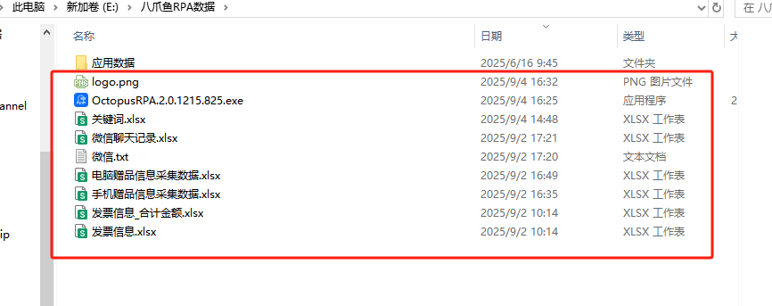
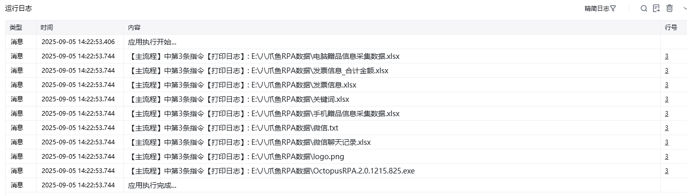

## 指令说明

**描述：** 在文件夹中获取文件

## 参数说明

<Tabs>
  <Tab title="常规">
    

    | 参数 | 说明 |
    | --- | --- |
    | **文件夹** | 输入或选择待获取的文件夹路径 |
    | **文件名匹配规则** | 输入文件名匹配规则，允许使用通配符，比如“图片*"或"图片?"，多个规则用“\|“分隔，比如:规则1\|规则2；*.* 表示全部文件。 |
    | **查找子文件夹** | 是否查找子文件夹下的文件 |
    | **忽略隐藏的文件** | 是否忽略隐藏的文件 |
    | **指定文件列表排序规则** | 指定文件列表排序规则 |
    | **排序因素** | 选择文件列表排序因素： 文件名称、 文件大小、 文件创建时间、 文件最后修改时间 |
    | **排序方式** | 选择文件列表排序方式： 顺序、 倒序 |
    | **保存文件列表至** | 指定一个变量名称，该变量用于保存获取的文件列表 |
  </Tab>
  <Tab title="高级">
    本指令暂无高级参数。
  </Tab>
</Tabs>

## 使用示例

**该流程执行逻辑：**

使用【获取文件列表】指令，将“E:\八爪鱼RPA数据”路径下的绝对文件路径地址根据文件名称，顺序排序保存到文件列表中；

使用【列表循环】指令，将每个文件的绝对文件路径地址打印输出。

### 运行结果

<Info>
  使用指令过程中遇到问题？前往 [八爪鱼RPA 开发者社区问答板块](https://rpa.bazhuayu.com/community/questions) 提问，获取官方与社区帮助。
</Info>
