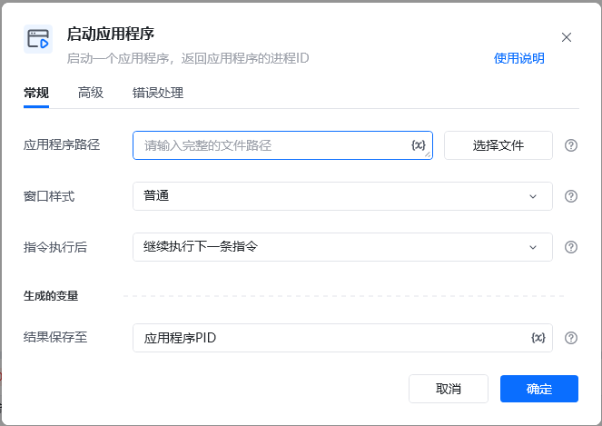
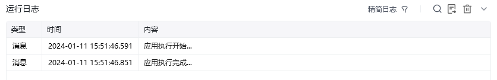
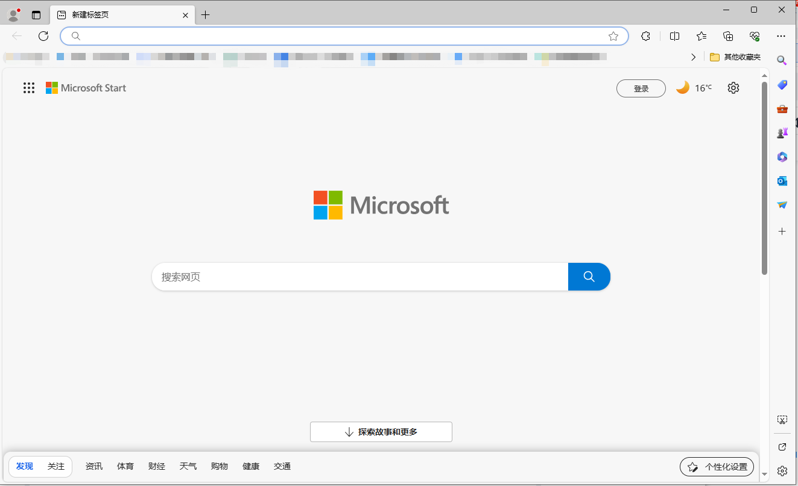

## 指令说明

**描述：** 启动一个应用程序，返回应用程序的进程ID

## 参数说明

<Tabs>
  <Tab title="常规">
    

    | 参数 | 说明 |
    | --- | --- |
    | **应用程序路径** | 应用程序可执行文件(.exe)的完整路径或待打开文件的完整路径 |
    | **窗口样式** | 指定应用程序启动后窗口的显示方式，普通，最小化，最大化 |
    | **指令执行后** | 执行启动指令后，继续向下执行或等待程序加载完成，继续执行下一条指令，等待主窗口出现，等待应用执行完成 |
  </Tab>
  <Tab title="高级">
    本指令暂无高级参数。
  </Tab>
</Tabs>

## 使用示例

**该流程执行逻辑：**

使用【启动应用程序】指令启动路径下"C:\....”的应用程序，并将进程ID保存到【应用程序PID】

### 运行结果

<Info>
  使用指令过程中遇到问题？前往 [八爪鱼RPA 开发者社区问答板块](https://rpa.bazhuayu.com/community/questions) 提问，获取官方与社区帮助。
</Info>
