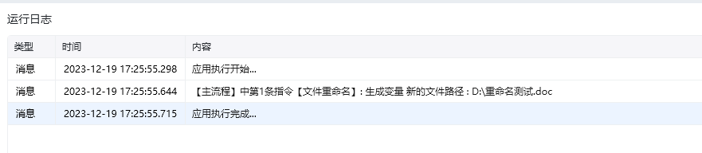

## 指令说明

**描述：** 修改一个文件的名称

## 参数说明

<Tabs>
  <Tab title="常规">
    

    | 参数 | 说明 |
    | --- | --- |
    | **要重命名的文件** | 选择需要重命名的文件 |
    | **文件新名称** | 输入文件的新名称，若新名称中不包含扩展名，则自动保留原文件的扩展名 |
    | **当文件存在时** | 当文件夹中已经存在同名的文件时，不执行重命名操作或覆盖原有的同名文件 |
    | **结果保存至** | 将修改后的文件的完整路径保存至变量，若不存在则自动创建 |
  </Tab>
  <Tab title="高级">
    本指令暂无高级参数。
  </Tab>
</Tabs>

## 使用示例

**该流程执行逻辑：**

使用【文件重命名】命令获取 D:\新建.xlsx 文件重命名为 “重命名测试” ，并将结果保存到变量：新的文件路径

### 效果展示

<Info>
  使用指令过程中遇到问题？前往 [八爪鱼RPA 开发者社区问答板块](https://rpa.bazhuayu.com/community/questions) 提问，获取官方与社区帮助。
</Info>
