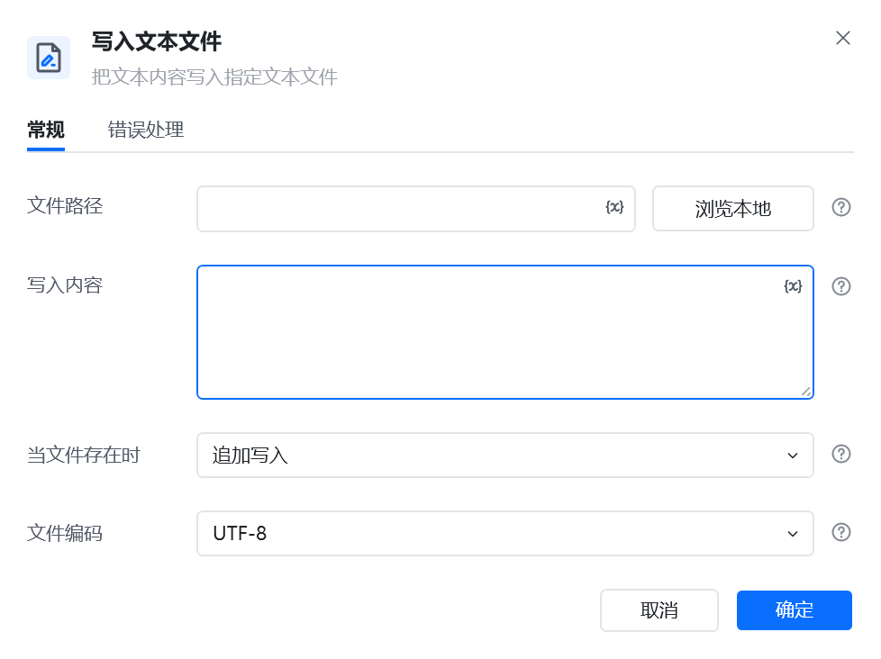
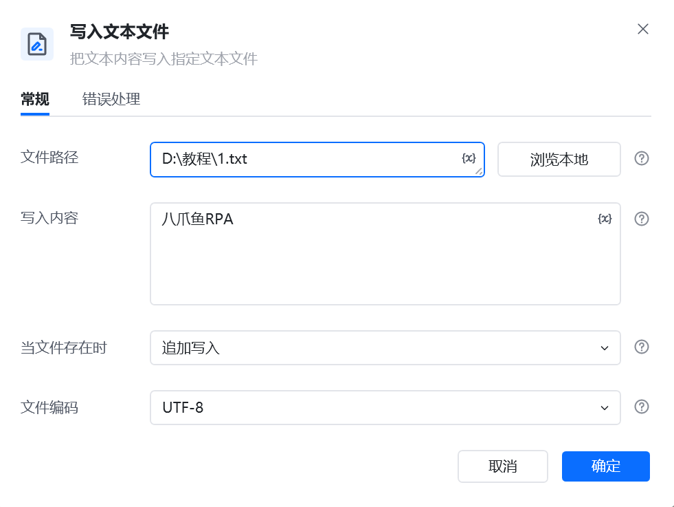
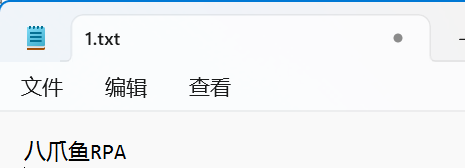

## 指令说明

**描述：** 把文本内容写入指定文本文件

## 参数说明

<Tabs>
  <Tab title="常规">

    

    | 参数 | 说明 |
    | --- | --- |
    | **文件路径** | 输入或选择文件路径 |
    | **写入内容** | 输入写入文件内容 |
    | **当文件存在时** | 指定当要写入的文件存在时要执行的操作 |
    | **文件编码** | 选择文件编码方式，系统默认，UTF-8，ASCll，UTF-8 Bom，Unicode，GBK，GB2312 |
  </Tab>
  <Tab title="高级">
    本指令暂无高级参数。
  </Tab>
</Tabs>

## 使用示例

**该流程执行逻辑：**

1. 在【写入文本文件】中选择目标文本文件，填写要写入的内容并设置写入方式与文本编码。
2. 运行指令后，文本按照覆盖或追加方式写入文件。
3. 打开目标文件即可确认写入结果，后续流程也可以通过【读取文本文件内容】继续读取该内容。

### 效果展示

<Info>
  使用指令过程中遇到问题？前往 [八爪鱼RPA 开发者社区问答板块](https://rpa.bazhuayu.com/community/questions) 提问，获取官方与社区帮助。
</Info>
