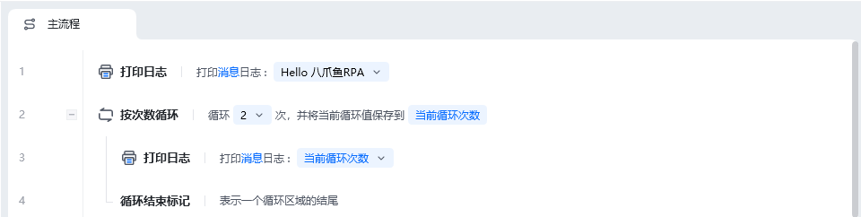
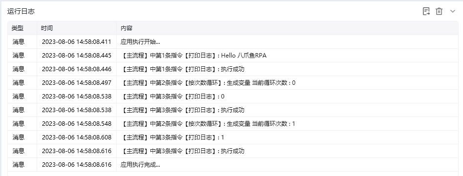
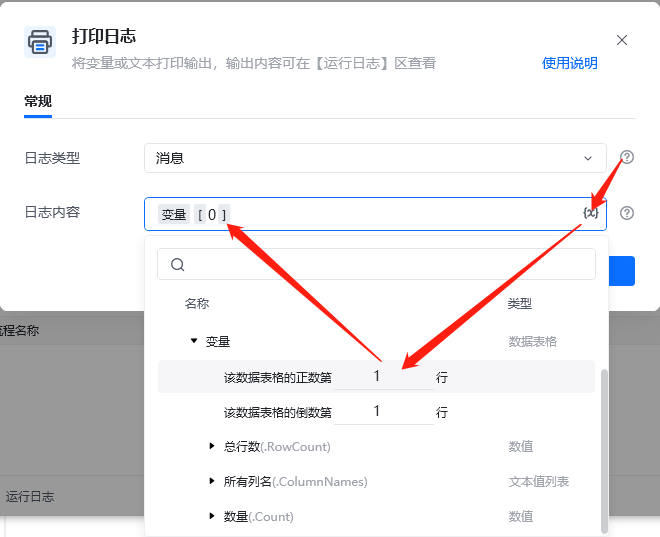
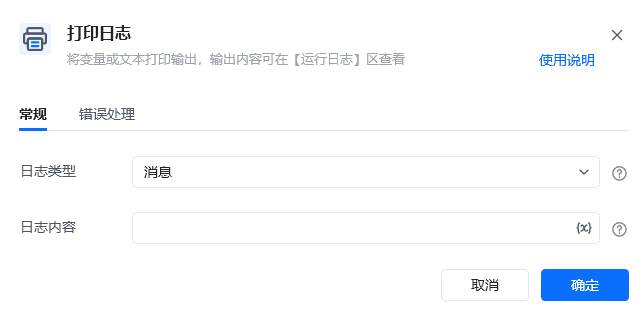

## 指令说明

**描述：** 将变量或文本打印输出，输出内容可在【运行日志】区查看

## 参数说明

<Tabs>
  <Tab title="常规">
    

    | 参数 | 说明 |
    | --- | --- |
    | **日志类型** | 选择打印的日志类型： 消息：常用选择（默认）、 错误、 警告 |
    | **日志内容** | 输入打印的内容 |
  </Tab>
  <Tab title="高级">
    本指令暂无高级参数。
  </Tab>
</Tabs>

## 使用示例

**该流程执行逻辑：**

第一行使用【打印日志】打印”Hello 八爪鱼RPA“消息日志；

第三行循环体执行【打印日志】指令打印当前循环次数；

### 效果展示

<Info>
  使用指令过程中遇到问题？前往 [八爪鱼RPA 开发者社区问答板块](https://rpa.bazhuayu.com/community/questions) 提问，获取官方与社区帮助。
</Info>
