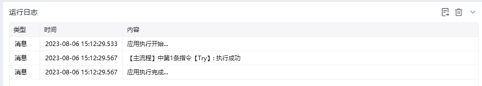

## 指令说明

**描述：** 标记【尝试执行】与【失败时执行】结构的结束位置，使流程从异常处理结构之后继续运行。

## 参数说明

<Tabs>
  <Tab title="常规">

    

本指令无可配置参数，仅作为 Try/Catch 异常处理块的结束标记。
  </Tab>
  <Tab title="高级">
本指令暂无高级参数。
  </Tab>
</Tabs>

## 使用示例

**该流程执行逻辑：**

使用【Try】尝试执行下面的命令

使用【Catch】捕获错误信息，并将错误信息保存到”错误信息“

使用【打印日志】指令打印错误信息

执行【EndTry】结束尝试执行

### 效果展示

<Info>
  使用指令过程中遇到问题？前往 [八爪鱼RPA 开发者社区问答板块](https://rpa.bazhuayu.com/community/questions) 提问，获取官方与社区帮助。
</Info>
