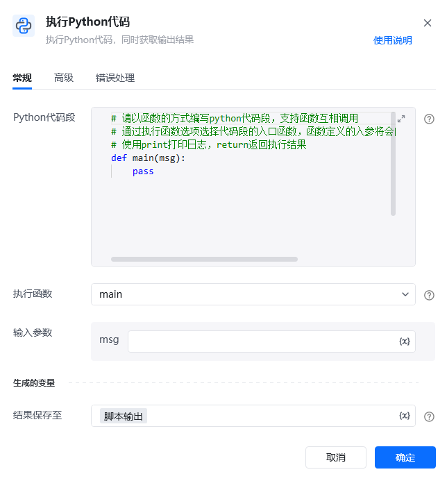
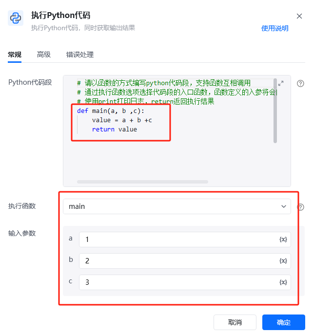
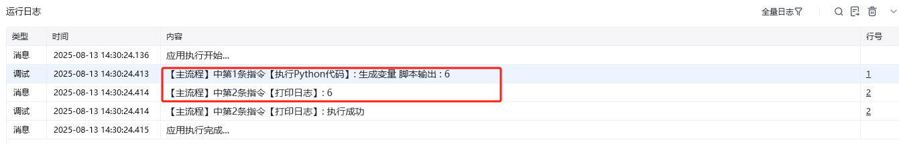

## 指令说明

**描述：** 执行Python代码，同时获取输出结果

## 参数说明

<Tabs>
  <Tab title="常规">
    

    | 参数 | 说明 |
    | --- | --- |
    | **Python代码段** | python代码需要以函数形式编写和执行 |
    | **执行函数** | 选择需要执行代码段中的哪一个函数 |
    | **输入参数** | 流程变量以函数入参方式传入，如main(a,b)函数包含a,b两个入参，当选择执行函数时可传入a,b流程变量 |
    | **结果保存至** | 指定一个变量名称，该变量用于保存python代码执行函数后return的返回值 |
  </Tab>
  <Tab title="高级">
    | 参数 | 说明 |
    | --- | --- |
    | **使用本机Python环境** | 勾选则使用的是本机的Python环境 |
    | **检测方式** | 自动检测系统可用的Python环境 使用指定目录下的Python环境 |
  </Tab>
</Tabs>

## 使用示例

**该流程执行逻辑：**

使用【执行Python脚本】指令执行Python代码段，代码段中定义了main() 函数，main() 函数有a、b、c三个参数，函数内部将a、b、c的和赋值给value变量，并将value变量return返回；

【执行Python脚本】指令中下拉选择执行了main() 函数，将a：1、b：2、c：3三个参数传输进去计算1+2+3，所以return返回的值是：6，并将返回值「脚本输出」打印出来。

入口函数的入参以及返回值：仅支持 string、 bool、int、 foat、 list、 dict类型数据；其他类型数据请自行在代码段中编写代码转换；

如果代码段中用到其他python包，代码段import 导入即可。

### 运行结果

<Info>
  使用指令过程中遇到问题？前往 [八爪鱼RPA 开发者社区问答板块](https://rpa.bazhuayu.com/community/questions) 提问，获取官方与社区帮助。
</Info>
