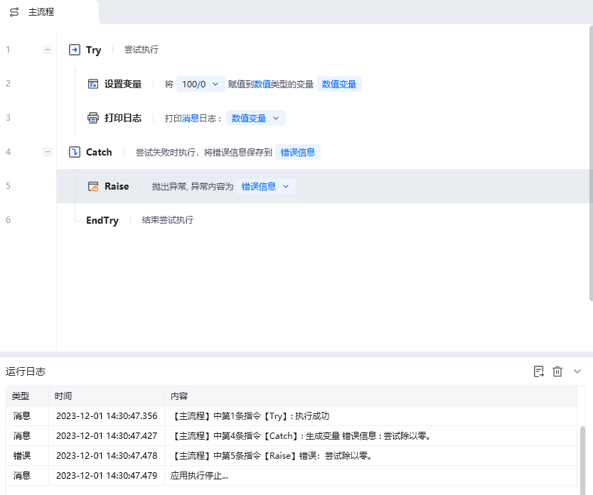
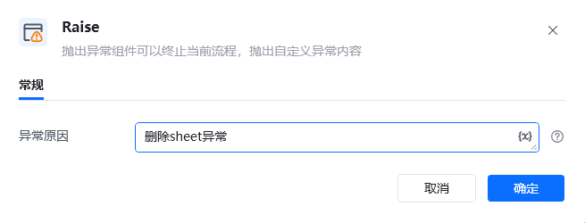
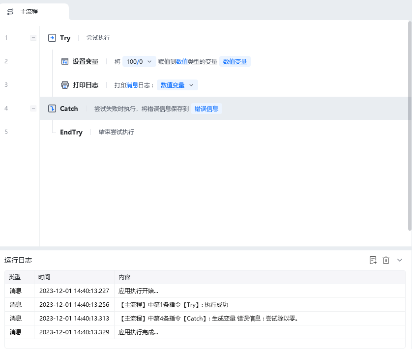
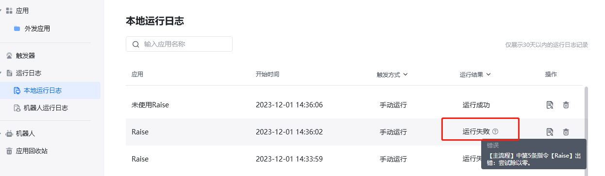

## 指令说明

**描述：** 该抛出异常指令可以终止当前流程，抛出自定义异常内容。

## 参数说明

<Tabs>
  <Tab title="常规">
    

    | 参数 | 说明 |
    | --- | --- |
    | **异常原因** | 填写异常的原因，自定义异常内容，也可以调用参数。 |
  </Tab>
  <Tab title="高级">
    本指令暂无高级参数。
  </Tab>
</Tabs>

## 使用示例

**该流程执行逻辑：**

场景：在设置了定时触发且做了try catch的任务中，可以使用raise抛出异常，让业务人员知道本次执行是否正常执行。

使用Raise的应用：

使用【Try】尝试执行【设置变量】和【打印日志】指令。

使用【Catch】捕获错误信息，并将错误信息保存到”错误信息“

使用【Raise】抛出错误信息，并将应用停止运行。

未使用Raise的应用：

结果对比：

对于都使用了Try的应用，相同的流程，使用了Raise运行结果会是失败，未使用的是成功。这样能让我们清楚知道应用的执行情况是怎样的。

### 运行结果

<Info>
  使用指令过程中遇到问题？前往 [八爪鱼RPA 开发者社区问答板块](https://rpa.bazhuayu.com/community/questions) 提问，获取官方与社区帮助。
</Info>
