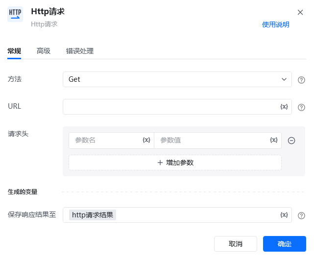
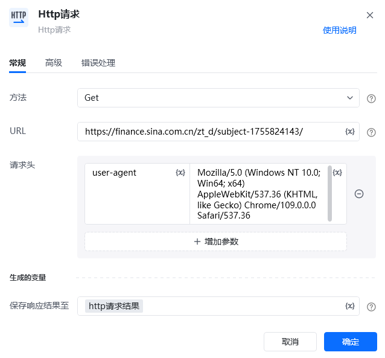
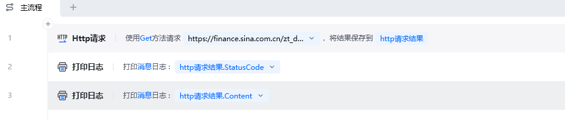
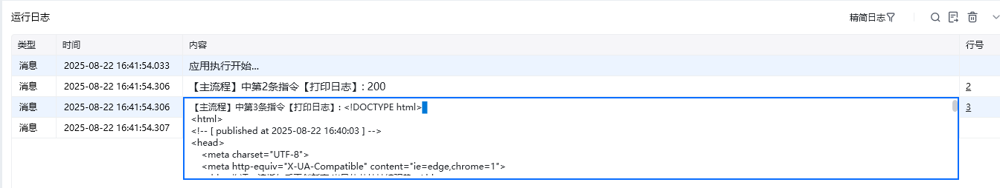

## 指令说明

**描述：** 发送一个HTTP请求，支持设置请求头以及请求体，请求成功后会将请求响应结果保存到一个变量里

## 参数说明

<Tabs>
  <Tab title="常规">
    

    | 参数 | 说明 |
    | --- | --- |
    | **方法** | 选择请求方法，支持选择GET/POST/PUT/DELETE/OPTIONS等方法 |
    | **URL** | 输入或选择待请求的URL地址 |
    | **请求头** | 设置 HTTP 请求头，支持多个，每个请求头都需要设置“参数名”和“参数值” |
    | **请求体** | 设置待发送到服务器的内容，支持多行，根据不同类型的请求，填写不同格式的值 |
    | **生成的变量** | 指定一个变量名称，该变量用于存储响应信息。 响应内容类型若为Json,可结合文本转为Json对象指令及json解析表达式对响应内容进行解析，具体方法请参考帮助文档一用户手册中的Json相关指令和解析方法 |
  </Tab>
  <Tab title="高级">
    | 参数 | 说明 |
    | --- | --- |
    | **连接超时时间（s）** | 设置请求最大超时时间（秒） |
    | **响应结果保存到文件** | 将响应结果保存至文件中，需配置文件保存目录及文件名称，文件格式与响应内容相对应 |
    | **文件保存目录** | 输入要保存到的文件夹路径 |
    | **文件名称** | 输入要保存到的文件名称 |
  </Tab>
</Tabs>

## 使用示例

**该流程执行逻辑：**

1. 在【Http请求】中选择 `GET` 方法，填写示例 URL，并把响应保存到变量“http请求结果”。
2. 执行请求后，使用【打印日志】输出 `http请求结果.StatusCode`，确认服务器返回的状态码。
3. 再输出 `http请求结果.Content` 查看响应正文；正式流程中可根据状态码判断是否继续解析内容或进入错误处理。

### 效果展示

<Info>
  使用指令过程中遇到问题？前往 [八爪鱼RPA 开发者社区问答板块](https://rpa.bazhuayu.com/community/questions) 提问，获取官方与社区帮助。
</Info>
