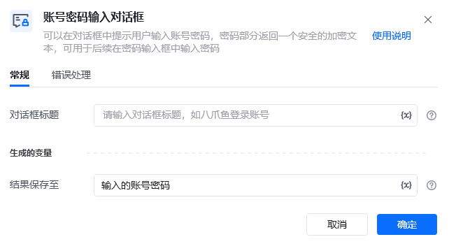
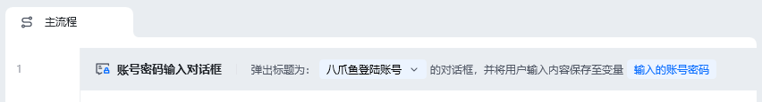
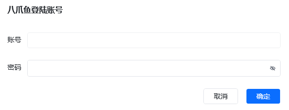
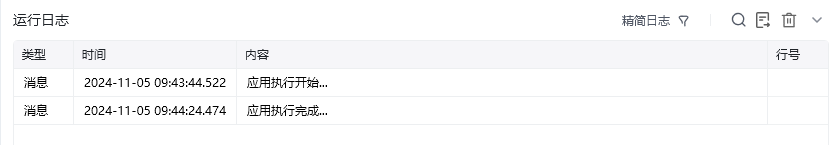

## 指令说明

**描述：** 可以在对话框中提示用户输入账号密码，密码部分返回一个安全的加密文本，可用于后续在密码输入框中输入密码。

## 参数说明

<Tabs>
  <Tab title="常规">
    

    | 参数 | 说明 |
    | --- | --- |
    | **对话框标题** | 请输入弹出对话框窗口的标题，如八爪鱼登录账号 |
  </Tab>
  <Tab title="高级">
    本指令暂无高级参数。
  </Tab>
</Tabs>

## 使用示例

**该流程执行逻辑：**

使用【账号密码输入对话框】弹出输入框，标题为：八爪鱼登录账号，可以在该对话框中输入账号密码

### 运行结果

<Info>
  使用指令过程中遇到问题？前往 [八爪鱼RPA 开发者社区问答板块](https://rpa.bazhuayu.com/community/questions) 提问，获取官方与社区帮助。
</Info>
