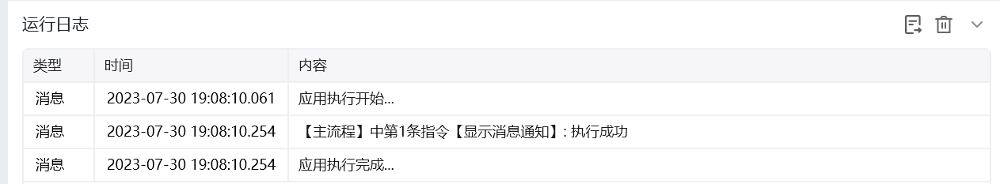
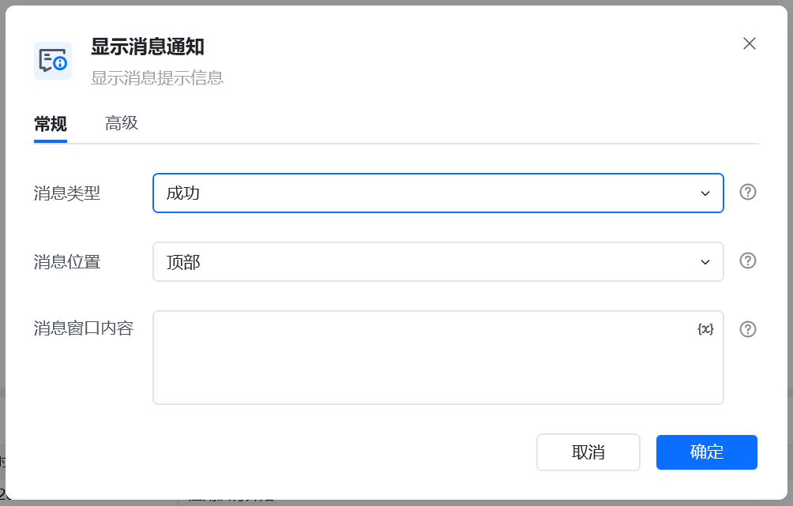

## 指令说明

**描述：** 显示消息提示信息

## 参数说明

<Tabs>
  <Tab title="常规">
    

    | 参数 | 说明 |
    | --- | --- |
    | **消息类型** | 选择弹出消息的类型，成功、警告、异常、信息 |
    | **消息位置** | 选择弹出消息的位置，顶部、底部、右下 |
    | **消息窗口内容** | 输入要显示消息的内容文本 |
    | **关闭超时时间** | 设置关闭超时时间 |
  </Tab>
  <Tab title="高级">
    本指令暂无高级参数。
  </Tab>
</Tabs>

## 使用示例

**该流程执行逻辑：**

使用【显示消息通知】在屏幕顶部弹出成功级别的提示框

### 运行结果

<Info>
  使用指令过程中遇到问题？前往 [八爪鱼RPA 开发者社区问答板块](https://rpa.bazhuayu.com/community/questions) 提问，获取官方与社区帮助。
</Info>
