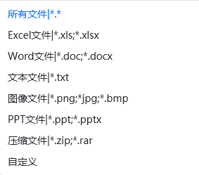
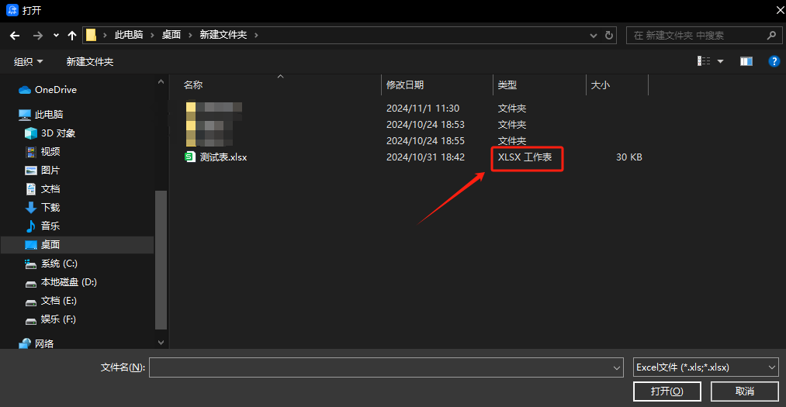

## 指令说明

**描述：** 弹出对话框，让用户选择目标文件并点击确认，返回用户选择的文件路径

## 参数说明

<Tabs>
  <Tab title="常规">
    

    | 参数 | 说明 |
    | --- | --- |
    | **对话框标题** | 请输入对话框的标题，显示在对话框窗口的左上角，非必填，不填则默认为“请选择文件” |
    | **文件类型** | 请选择限制可选的文件类型，选项如下图所示，支持自定义文件类型。该参数下方有个“允许多选”的勾选框，不勾选，则用户只能选择单个文件，返回文件路径文本；若勾选，用户可以选择多个文件，返回文件路径列表 |
    | **自定义类型** | 请输入符合文件类型过滤描述的文本，使用\|分割，前面为显示的描述文字，后面为文件类型，可以多组（该参数在文件类型选择“自定义”时才需填写）。例如：图像文件(*.bmp, *.jpg)\|*.bmp;*.jpg\|所有文件(*.*)\|*.* |
    | **初始目录** | 请选择对话框显示时定位到的默认目录，不填则定位到上次操作的目录。该参数下方有个“检查文件是否存在”的勾选框，若勾选，用户只能选择已经存在的文件路径，不勾选则用户可以输入不存在的文件 |
  </Tab>
  <Tab title="高级">
    本指令暂无高级参数。
  </Tab>
</Tabs>

## 使用示例

**该流程执行逻辑：**

使用【打开选择文件对话框】弹出标题为“请选择文件”的对话框，可以在该对话框中选择文件类型为Excel的文件

### 效果展示

<Info>
  使用指令过程中遇到问题？前往 [八爪鱼RPA 开发者社区问答板块](https://rpa.bazhuayu.com/community/questions) 提问，获取官方与社区帮助。
</Info>
