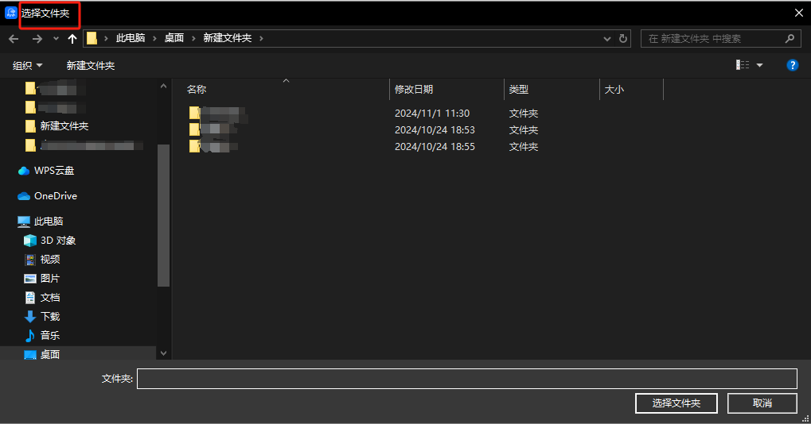

## 指令说明

**描述：** 弹出选择文件对话框，让用户选择目标文件并点击确认，返回用户选择的文件路径

## 参数说明

<Tabs>
  <Tab title="常规">
    

    | 参数 | 说明 |
    | --- | --- |
    | **对话框标题** | 请输入对话框的标题，显示在对话框窗口的左上角，非必填，不填则默认为“请选择文件夹” |
    | **初始目录** | 请选择对话框显示时定位到的默认目录，不填则定位到上次操作的目录 |
  </Tab>
  <Tab title="高级">
    本指令暂无高级参数。
  </Tab>
</Tabs>

## 使用示例

**该流程执行逻辑：**

使用【打开选择文件夹对话框】弹出标题为“请选择文件夹”的对话框，可以在该对话框中选择任意文件夹

### 运行结果

<Info>
  使用指令过程中遇到问题？前往 [八爪鱼RPA 开发者社区问答板块](https://rpa.bazhuayu.com/community/questions) 提问，获取官方与社区帮助。
</Info>
