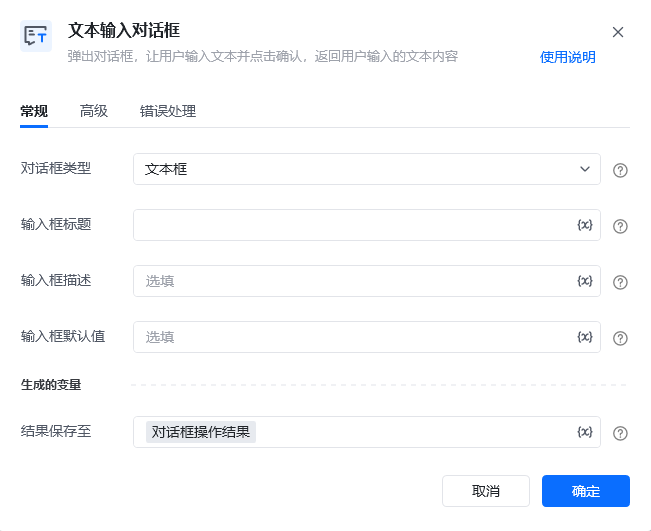
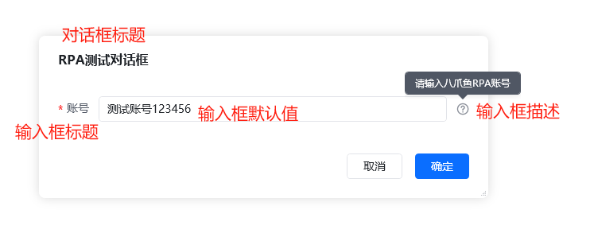
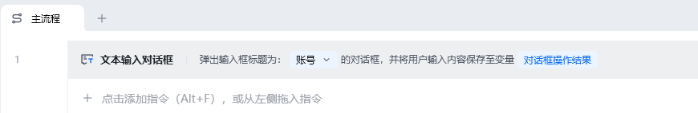
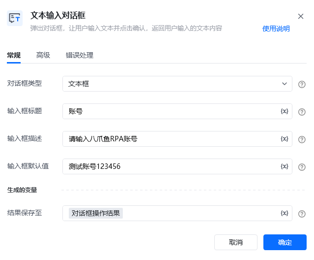
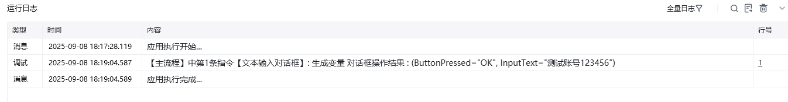

## 指令说明

**描述：** 弹出对话框，让用户输入文本并点击确认，返回用户输入的文本内容

## 参数说明

<Tabs>
  <Tab title="常规">
    

    | 参数 | 说明 |
    | --- | --- |
    | **对话框类型** | 请选择需要使用的输入框类型，支持文本框和多行文本框 |
    | **输入框标题** | 输入框的标题，如用户名，建议8个字符以内，更多可以使用输入框描述 |
    | **输入框描述** | 输入框填写提示，可进一步提醒用户需要输入的内容 |
    | **输入框默认值** | 输入框内默认显示的文本内容 |
  </Tab>
  <Tab title="高级">
    | 参数 | 说明 |
    | --- | --- |
    | **对话框标题** | 弹出对话框窗口的标题 |
    | **输入框空白提示** | 未在输入框中输入内容且没有默认值时显示的提示信息 |
    | **输入框为必填框** | 设置输入框内容是否为必填，默认为非必填 |
  </Tab>
</Tabs>

## 使用示例

**该流程执行逻辑：**

无

### 运行结果

<Info>
  使用指令过程中遇到问题？前往 [八爪鱼RPA 开发者社区问答板块](https://rpa.bazhuayu.com/community/questions) 提问，获取官方与社区帮助。
</Info>
