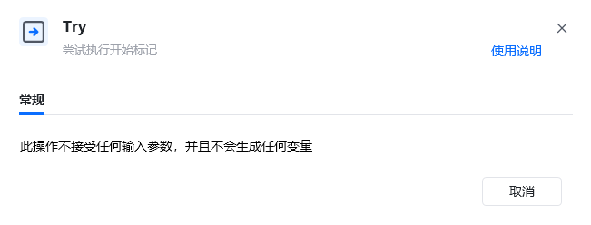
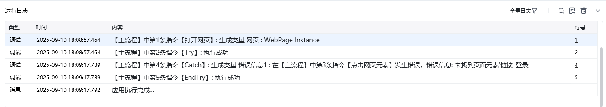
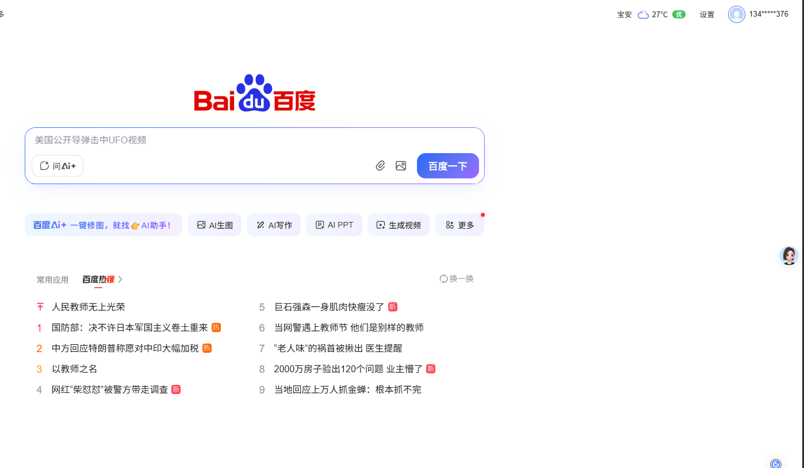
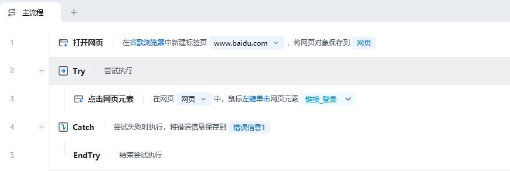

## 指令说明

**描述：** 尝试执行

## 参数说明

<Tabs>
  <Tab title="常规">
    

    本指令暂无常规参数。
  </Tab>
  <Tab title="高级">
    本指令暂无高级参数。
  </Tab>
</Tabs>

## 使用示例

**该流程执行逻辑：**

使用【打开网页】指令打开八爪鱼官网

使用【Try】尝试执行下面的命令

尝试执行【点击网页元素】点击登录按钮元素

使用【Catch】捕获错误信息，并将错误信息保存到”错误信息“

执行【EndTry】结束尝试执行

效果展示：

RPA运行前：

RPA运行后：

### 运行结果

<Info>
  使用指令过程中遇到问题？前往 [八爪鱼RPA 开发者社区问答板块](https://rpa.bazhuayu.com/community/questions) 提问，获取官方与社区帮助。
</Info>
