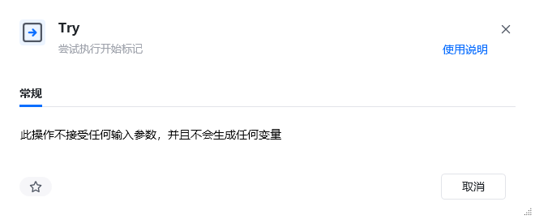
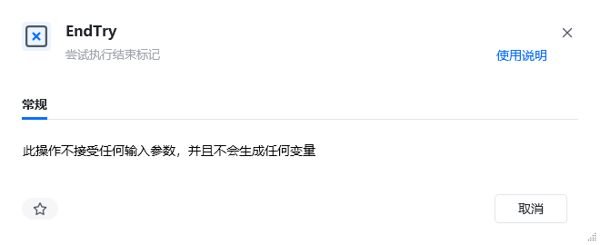
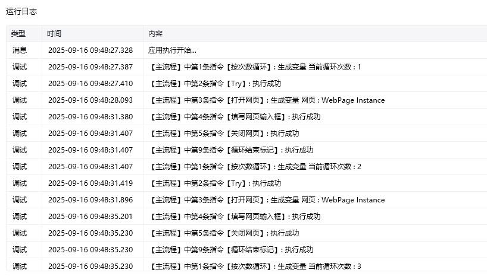

## 指令说明

**描述：** 异常处理模块为我们提供流程执行中处理异常情况，保证自动化流程稳定性的功能，覆盖的指令包括：Try、Catch、EndTry

## 使用示例

**该流程执行逻辑：**

配置参数说明

配置参数说明

配置参数说明

### 效果展示

<Info>
  使用指令过程中遇到问题？前往 [八爪鱼RPA 开发者社区问答板块](https://rpa.bazhuayu.com/community/questions) 提问，获取官方与社区帮助。
</Info>
