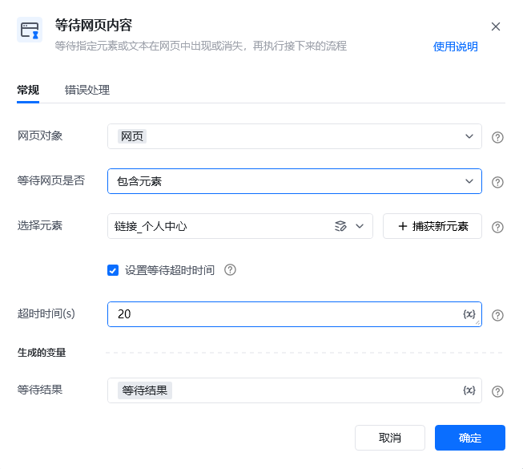

## 指令说明

**描述：** 等待指定元素或文本在网页中出现或消失，再执行接下来的流程。流程执行到该指令时，会先判断当前网页是否出现指定的元素/文本，如出现则立即执行下一步。如未出现，则每隔 0.2 秒再判断一次，直到达到设置的等待超时时间或元素/文本出现。

<Info>
  不勾选设置超时时间有可能导致应用一直在等待，卡住不动。该选项默认勾选，不建议取消；如要等待的元素/文本会较长时间才会出现，可设置较大的超时时间。
</Info>

## 参数说明

<Tabs>
  <Tab title="常规">
    

    | 参数 | 说明 |
    | --- | --- |
    | **网页对象** | 选择一个之前通过【打开网页】或【获取已打开的网页对象】指令创建的网页对象 |
    | **等待网页是否** | 包含元素、不包含元素、包含文本、不包含文本。即指定的元素或文本是否出现 |
    | **选择元素** | 元素：从元素库中选择一个已捕获的元素或通过「捕获新元素」来捕获新的网页元素作为操作目标。文本：直接输入文本或选择文本变量 |
    | **超时时间（s）** | 设置超时时间，单位为秒，达到超时时间后，元素/文本还没有出现，将不再继续等待，流程会继续往下执行 |
    | **等待结果** | 等待结果是布尔值。在超时时间内，等待的元素/文本出现了，则返回 true；未出现，则返回 false |
  </Tab>
  <Tab title="高级">
    本指令暂无高级参数。
  </Tab>
</Tabs>

## 使用示例

**该流程执行逻辑：**

使用【打开网页】打开 www.baidu.com 网页

使用【鼠标悬停在网页元素上】鼠标悬停在"八爪鱼大数据"元素上

使用【等待页面内容】指令等待"个人中心"元素出现

若在超时时间内出现则使用【点击网页元素】点击"个人中心"元素

### 运行结果

等待头像下拉框弹出后进行点击，成功进入个人中心页面。

<Info>
  使用指令过程中遇到问题？前往 [八爪鱼RPA 开发者社区问答板块](https://rpa.bazhuayu.com/community/questions) 提问，获取官方与社区帮助。
</Info>
