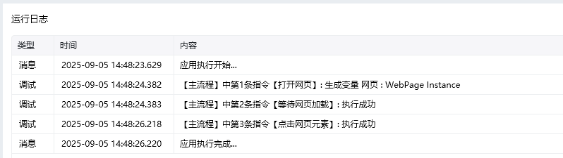

## 指令说明

**描述：** 在指定的时间内，等待网页加载完成。

<Info>
  该指令通常配合【打开网页】或【获取已打开的网页对象】指令使用，确保页面完全加载后再执行后续操作。
</Info>

## 参数说明

<Tabs>
  <Tab title="常规">
    

    | 参数 | 说明 |
    | --- | --- |
    | **网页对象** | 选择一个之前通过【打开网页】或【获取已打开的网页对象】指令创建的网页对象 |
    | **加载超时时间** | 等待网页加载完成的超时时间，可适当延长 |
    | **加载超时后执行** | 当等待时间超过加载超时时间后，执行「错误处理」或停止网页加载 |
  </Tab>
  <Tab title="高级">
    本指令暂无高级参数。
  </Tab>
</Tabs>

## 使用示例

**该流程执行逻辑：**

使用【打开网页】指令在八爪鱼浏览器打开百度网址

使用【等待页面加载完成】等待网页加载完成，超过 5 秒未加载完成，停止网页加载

网页加载完成后模拟人工鼠标左键单击新闻按钮

### 运行结果

页面加载完成后，流程自动点击新闻按钮进入新闻页面。

<Info>
  使用指令过程中遇到问题？前往 [八爪鱼RPA 开发者社区问答板块](https://rpa.bazhuayu.com/community/questions) 提问，获取官方与社区帮助。
</Info>
