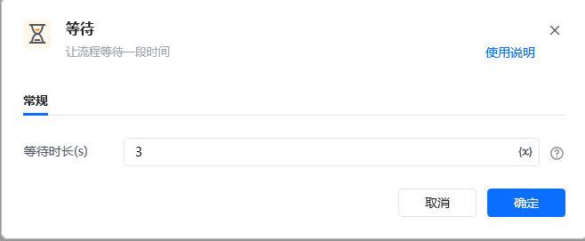
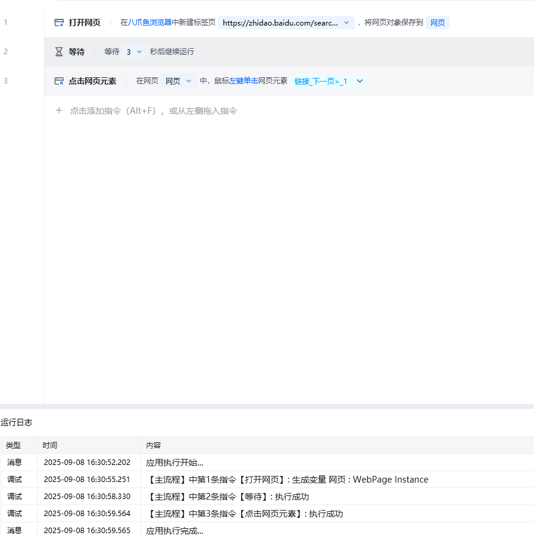

## 指令说明

**描述：** 让流程等待指定的时间，然后再执行后面的指令。

## 参数说明

<Tabs>
  <Tab title="常规">
    

    | 参数 | 说明 |
    | --- | --- |
    | **等待时长（s）** | 输入流程等待的时间，单位是秒。配合产生随机数指令，可以等待随机时间 |
  </Tab>
  <Tab title="高级">
    本指令暂无高级参数。
  </Tab>
</Tabs>

## 使用示例

**该流程执行逻辑：**

使用【打开网页】指令在八爪鱼浏览器打开目标网页

等待时间 3 秒后再执行下一个步骤【点击网页元素】

### 效果展示

流程暂停 3 秒后，继续执行后续操作。

<Info>
  使用指令过程中遇到问题？前往 [八爪鱼RPA 开发者社区问答板块](https://rpa.bazhuayu.com/community/questions) 提问，获取官方与社区帮助。
</Info>
