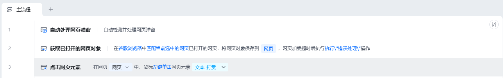
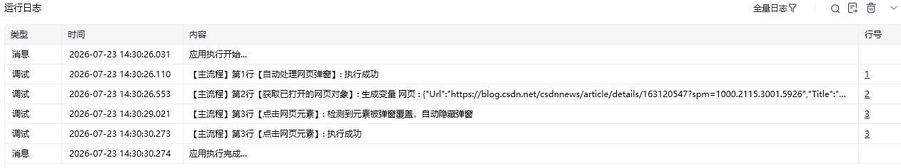

## 指令说明

**描述：** 指令运行后，在执行点击、输入等操作时，操作失败后会自动检测元素是否被弹窗覆盖，如果被覆盖则自动隐藏弹窗，确保操作正常执行。

## 参数说明

<Tabs>
<Tab title="常规">
    

    | 参数 | 说明 |
    | --- | --- |
    | **网页对象** | 选择要操作的网页对象 |
  </Tab>
  <Tab title="高级">
    本指令暂无高级参数。
  </Tab>
</Tabs>

## 使用示例

**该流程执行逻辑：**

在流程开头添加【自动处理网页弹窗】指令

后续流程执行点击、输入等操作时

如果操作失败（元素被弹窗覆盖），会自动隐藏弹窗并重试操作

### 运行结果

当目标元素被弹窗遮挡导致操作失败时，自动处理弹窗并继续执行操作。

<Info>
  使用指令过程中遇到问题？前往 [八爪鱼RPA 开发者社区问答板块](https://rpa.bazhuayu.com/community/questions) 提问，获取官方与社区帮助。
</Info>
