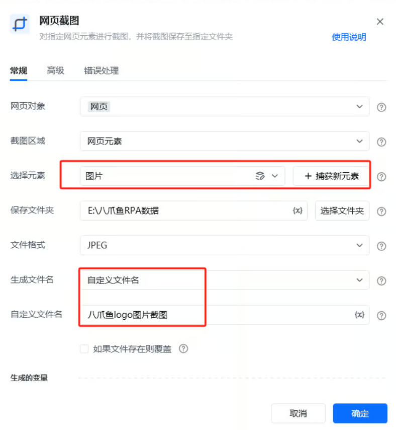

## 指令说明

**描述：** 对指定网页元素进行截图，并将截图保存至指定文件夹。

## 参数说明

<Tabs>
<Tab title="常规">
    

    | 参数 | 说明 |
    | --- | --- |
    | **网页对象** | 选择一个之前通过【打开网页】或【获取已打开的网页对象】指令创建的网页对象 |
    | **截图区域** | 三种区域，若选择整个网页，会生成整个页面的长图。 网页元素：通过指定操作目标的显示内容进行截图 网页可见区域：截取当前浏览器中可视区域的图片 整个网页：整个网页有滚动条的情况，会滚动网页之后进行整个网页长截图 |
    | **选择元素** | 选择要操作的目标元素 |
    | **保存文件夹** | 截图的保存文件夹位置选择 |
    | **文件格式** | 截图图片的文件格式：JPEG / PNG |
    | **生成文件名** | 选择生成随机文件名或自定义文件名 |
    | **截图保存位置** | 截图文件所在的位置:文件路径+名称 |
  </Tab>
  <Tab title="高级">
    | 参数 | 说明 |
    | --- | --- |
    | **等待元素存在（s）** | 等待目标元素存在的超时时间，单位 秒 |
  </Tab>
</Tabs>

## 使用示例

**该流程执行逻辑：**

打开八爪鱼RPA官网：https://rpa.bazhuayu.com/

使用【网页截图】指令对「八爪鱼logo」网页区域进行JPEG图片的截图，并将图片保存至“E:\八爪鱼RPA数据”文件夹中。

### 效果展示

网页/元素截图成功保存到指定路径。

<Info>
  使用指令过程中遇到问题？前往 [八爪鱼RPA 开发者社区问答板块](https://rpa.bazhuayu.com/community/questions) 提问，获取官方与社区帮助。
</Info>
